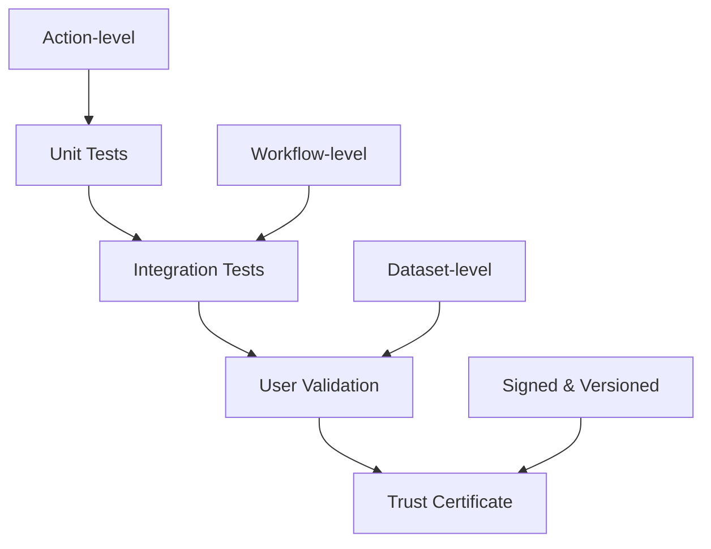

# BioMapper Validation Framework

## Overview

The Validation Framework is the cornerstone of BioMapper's scientific credibility, ensuring that AI-accelerated workflows produce results identical to or better than traditional bioinformatics pipelines.

## Core Validation Philosophy

### Principle: Trust Through Transparency
Every BioMapper workflow can be validated against gold-standard tools with full transparency of methods, metrics, and results.

### Three-Tier Validation Architecture



## Tier 1: Unit Test Validation

### Action-Level Testing
Every action must pass comprehensive unit tests before deployment.

```python
# Required test coverage for each action
class TestActionValidation:
    def test_correct_output_format(self):
        """Validates output structure matches specification."""
        pass
    
    def test_handles_edge_cases(self):
        """Tests empty input, missing data, malformed data."""
        pass
    
    def test_biological_consistency(self):
        """Ensures biological rules are maintained."""
        pass
    
    def test_performance_benchmarks(self):
        """Validates execution time and memory usage."""
        pass
```

### Automated Test Generation
Claude Code generates test cases based on biological constraints:

```python
# Claude-generated test for metabolite matching
def test_stereoisomer_handling():
    """Test that D-glucose and L-glucose are distinguished."""
    action = MetaboliteMatch()
    d_glucose = action.match("D-glucose")
    l_glucose = action.match("L-glucose")
    assert d_glucose.id != l_glucose.id
    assert d_glucose.stereochemistry == "D"
    assert l_glucose.stereochemistry == "L"
```

## Tier 2: Integration Test Validation

### Workflow-Level Validation
Complete strategies are validated against established pipelines.

```yaml
# Validation configuration
validation:
  strategy: "metabolomics_harmonization"
  reference_tools:
    - tool: "metaboanalyst"
      version: "5.0"
      dataset: "benchmark_metabolites_1000.csv"
    - tool: "xcms"
      version: "3.18"
      dataset: "lcms_standard_mix.mzML"
  
  metrics:
    - type: "correlation"
      threshold: 0.95
    - type: "concordance"
      threshold: 0.90
    - type: "sensitivity"
      threshold: 0.85
```

### Benchmark Datasets

#### Metabolomics Benchmarks
```yaml
benchmarks:
  metabolomics:
    - name: "NIST_SRM_1950"
      description: "NIST plasma reference with 100+ metabolites"
      validated_results: "gold_standard/nist_srm_1950.csv"
    
    - name: "MTBLS1"
      description: "MetaboLights reference dataset"
      validated_results: "gold_standard/mtbls1_processed.csv"
```

#### Genomics Benchmarks
```yaml
benchmarks:
  genomics:
    - name: "GIAB_HG001"
      description: "Genome in a Bottle NA12878"
      validated_results: "gold_standard/giab_hg001_variants.vcf"
    
    - name: "Platinum_Genomes"
      description: "Illumina Platinum Genomes"
      validated_results: "gold_standard/platinum_genomes.vcf"
```

### Validation Action Implementation

```python
@register_action("VALIDATE_AGAINST_REFERENCE")
class ValidateAgainstReference(TypedStrategyAction):
    """Validates BioMapper results against gold-standard tools."""
    
    async def execute_typed(self, params: ValidationParams, context: Dict):
        # Load results
        biomapper_results = self.load_results(params.biomapper_output)
        reference_results = self.load_reference(params.reference_output)
        
        # Compute metrics
        metrics = {}
        
        # 1. Statistical correlation
        if params.compute_correlation:
            metrics['pearson_r'], metrics['pearson_p'] = pearsonr(
                biomapper_results.values,
                reference_results.values
            )
            metrics['spearman_r'], metrics['spearman_p'] = spearmanr(
                biomapper_results.values,
                reference_results.values
            )
        
        # 2. Concordance metrics
        if params.compute_concordance:
            metrics['concordance'] = self.calculate_concordance(
                biomapper_results,
                reference_results
            )
        
        # 3. Classification metrics
        if params.compute_classification:
            metrics['sensitivity'] = self.calculate_sensitivity(
                biomapper_results,
                reference_results
            )
            metrics['specificity'] = self.calculate_specificity(
                biomapper_results,
                reference_results
            )
            metrics['f1_score'] = self.calculate_f1(
                biomapper_results,
                reference_results
            )
        
        # 4. Generate visualization
        if params.generate_plots:
            plots = self.generate_comparison_plots(
                biomapper_results,
                reference_results
            )
            metrics['visualizations'] = plots
        
        # 5. Create validation report
        if params.generate_report:
            report = self.create_validation_report(
                metrics,
                params,
                context
            )
            self.save_report(report, params.report_path)
        
        return ValidationResult(
            metrics=metrics,
            passed=self.check_thresholds(metrics, params.thresholds),
            report_path=params.report_path
        )
```

## Tier 3: User-Driven Validation

### Custom Dataset Validation
Users can validate BioMapper against their own established workflows:

```yaml
# User validation configuration
user_validation:
  name: "Lab-specific metabolomics pipeline"
  description: "Validate against our in-house R pipeline"
  
  user_pipeline:
    script: "user_scripts/metabolomics_pipeline.R"
    output: "user_results/metabolites_processed.csv"
  
  biomapper_strategy: "metabolomics_harmonization"
  
  comparison:
    key_column: "metabolite_id"
    value_columns: ["concentration", "p_value", "fold_change"]
    
  acceptance_criteria:
    correlation: 0.90
    missing_rate: 0.05
    false_positive_rate: 0.10
```

### Validation Interface

```python
class UserValidation:
    """Enables users to validate against their own pipelines."""
    
    def validate_against_user_pipeline(
        self,
        user_results: pd.DataFrame,
        biomapper_results: pd.DataFrame,
        config: UserValidationConfig
    ) -> ValidationReport:
        
        # Align datasets
        aligned_user, aligned_bio = self.align_datasets(
            user_results,
            biomapper_results,
            key=config.key_column
        )
        
        # Compare specified columns
        comparisons = {}
        for column in config.value_columns:
            comparisons[column] = self.compare_columns(
                aligned_user[column],
                aligned_bio[column]
            )
        
        # Check acceptance criteria
        passed = all(
            comparisons[col]['correlation'] >= config.acceptance_criteria.correlation
            for col in config.value_columns
        )
        
        return ValidationReport(
            comparisons=comparisons,
            passed=passed,
            recommendations=self.generate_recommendations(comparisons)
        )
```

## Validation Certificates

### Certificate Generation

```python
class ValidationCertificate:
    """Generates cryptographically signed validation certificates."""
    
    def generate_certificate(
        self,
        workflow_hash: str,
        validation_results: Dict,
        metadata: Dict
    ) -> Dict:
        
        certificate = {
            "version": "1.0",
            "timestamp": datetime.utcnow().isoformat(),
            "workflow": {
                "hash": workflow_hash,
                "name": metadata.get("strategy_name"),
                "version": metadata.get("strategy_version")
            },
            "validation": {
                "reference_tools": validation_results.get("reference_tools"),
                "metrics": validation_results.get("metrics"),
                "passed": validation_results.get("passed"),
                "confidence_level": self.calculate_confidence(validation_results)
            },
            "reproducibility": {
                "random_seed": metadata.get("random_seed"),
                "software_versions": self.get_software_versions(),
                "environment_hash": self.get_environment_hash()
            }
        }
        
        # Sign certificate
        certificate["signature"] = self.sign_certificate(certificate)
        
        return certificate
```

### Certificate Verification

```python
class CertificateVerifier:
    """Verifies validation certificates."""
    
    def verify_certificate(self, certificate: Dict) -> VerificationResult:
        # Check signature
        signature_valid = self.verify_signature(
            certificate.get("signature"),
            certificate
        )
        
        # Check workflow reproducibility
        workflow_reproducible = self.verify_workflow_hash(
            certificate["workflow"]["hash"]
        )
        
        # Check validation metrics
        metrics_valid = self.verify_metrics(
            certificate["validation"]["metrics"]
        )
        
        return VerificationResult(
            valid=signature_valid and workflow_reproducible and metrics_valid,
            details={
                "signature": signature_valid,
                "workflow": workflow_reproducible,
                "metrics": metrics_valid
            },
            trust_score=self.calculate_trust_score(certificate)
        )
```

## Validation Report Generation

### HTML Report Template

```html
<!DOCTYPE html>
<html>
<head>
    <title>BioMapper Validation Report</title>
    <style>
        .metric-pass { color: green; }
        .metric-fail { color: red; }
        .chart-container { width: 600px; height: 400px; }
    </style>
</head>
<body>
    <h1>Validation Report: {{ strategy_name }}</h1>
    
    <section id="summary">
        <h2>Summary</h2>
        <p>Overall Status: <span class="{{ status_class }}">{{ status }}</span></p>
        <p>Trust Score: {{ trust_score }}/100</p>
        <p>Validated Against: {{ reference_tools|join(", ") }}</p>
    </section>
    
    <section id="metrics">
        <h2>Validation Metrics</h2>
        <table>
            <tr>
                <th>Metric</th>
                <th>Value</th>
                <th>Threshold</th>
                <th>Status</th>
            </tr>
            
            <tr>
                <td>{{ metric.name }}</td>
                <td>{{ metric.value|round(3) }}</td>
                <td>{{ metric.threshold }}</td>
                <td class="{{ metric.status_class }}">{{ metric.status }}</td>
            </tr>
            
        </table>
    </section>
    
    <section id="visualizations">
        <h2>Comparison Plots</h2>
        <div class="chart-container">
            {{ correlation_plot|safe }}
        </div>
        <div class="chart-container">
            {{ bland_altman_plot|safe }}
        </div>
    </section>
    
    <section id="certificate">
        <h2>Validation Certificate</h2>
        <pre>{{ certificate_json|json_pretty }}</pre>
        <p>Verify at: <a href="{{ verification_url }}">{{ verification_url }}</a></p>
    </section>
</body>
</html>
```

## Validation Metrics Library

### Statistical Metrics

```python
class ValidationMetrics:
    """Comprehensive metrics for validation."""
    
    @staticmethod
    def correlation_metrics(x, y):
        """Compute correlation metrics."""
        return {
            "pearson_r": pearsonr(x, y)[0],
            "spearman_r": spearmanr(x, y)[0],
            "kendall_tau": kendalltau(x, y)[0]
        }
    
    @staticmethod
    def agreement_metrics(x, y):
        """Compute agreement metrics."""
        return {
            "concordance": concordance_correlation_coefficient(x, y),
            "cohen_kappa": cohen_kappa_score(x, y),
            "icc": intraclass_correlation(x, y)
        }
    
    @staticmethod
    def error_metrics(x, y):
        """Compute error metrics."""
        return {
            "mae": mean_absolute_error(x, y),
            "rmse": np.sqrt(mean_squared_error(x, y)),
            "mape": mean_absolute_percentage_error(x, y)
        }
```

### Biological Metrics

```python
class BiologicalValidation:
    """Biology-specific validation metrics."""
    
    @staticmethod
    def pathway_overlap(pathways1, pathways2):
        """Compute pathway overlap statistics."""
        return {
            "jaccard": len(pathways1 & pathways2) / len(pathways1 | pathways2),
            "overlap_coefficient": len(pathways1 & pathways2) / min(len(pathways1), len(pathways2)),
            "dice": 2 * len(pathways1 & pathways2) / (len(pathways1) + len(pathways2))
        }
    
    @staticmethod
    def go_term_similarity(terms1, terms2):
        """Compute GO term semantic similarity."""
        # Implementation using GO similarity measures
        pass
```

## Continuous Validation

### Automated Validation Pipeline

```yaml
# .github/workflows/validation.yml
name: Continuous Validation

on:
  push:
    paths:
      - 'biomapper/core/strategy_actions/**'
      - 'configs/strategies/**'

jobs:
  validate:
    runs-on: ubuntu-latest
    steps:
      - name: Run Unit Tests
        run: |
          poetry run pytest tests/unit/
          
      - name: Run Integration Tests
        run: |
          poetry run pytest tests/integration/
          
      - name: Validate Against Benchmarks
        run: |
          poetry run python scripts/validate_benchmarks.py
          
      - name: Generate Validation Report
        run: |
          poetry run python scripts/generate_validation_report.py
          
      - name: Upload Results
        uses: actions/upload-artifact@v2
        with:
          name: validation-report
          path: validation_report.html
```

## Trust Score Calculation

### Multi-Factor Trust Score

```python
class TrustScoreCalculator:
    """Calculates comprehensive trust score for strategies."""
    
    def calculate_trust_score(
        self,
        validation_results: Dict,
        community_metrics: Dict,
        usage_metrics: Dict
    ) -> float:
        
        # Validation component (40%)
        validation_score = self.score_validation(validation_results)
        
        # Community component (30%)
        community_score = self.score_community(community_metrics)
        
        # Usage component (20%)
        usage_score = self.score_usage(usage_metrics)
        
        # Reproducibility component (10%)
        reproducibility_score = self.score_reproducibility(validation_results)
        
        # Weighted average
        trust_score = (
            0.4 * validation_score +
            0.3 * community_score +
            0.2 * usage_score +
            0.1 * reproducibility_score
        )
        
        return round(trust_score, 2)
```

## Best Practices

### For Action Developers
1. Always include validation tests with new actions
2. Test against multiple reference implementations
3. Document validation assumptions
4. Provide example validation configurations

### For Strategy Authors
1. Include validation steps in strategies
2. Specify expected validation metrics
3. Provide benchmark datasets
4. Document known limitations

### For Users
1. Always run validation on new datasets
2. Compare with established pipelines
3. Report validation failures
4. Share successful validations

## Conclusion

The Validation Framework ensures that BioMapper's AI-powered acceleration never comes at the cost of scientific accuracy. Through comprehensive testing, transparent metrics, and reproducible certificates, we build trust in AI-native bioinformatics.