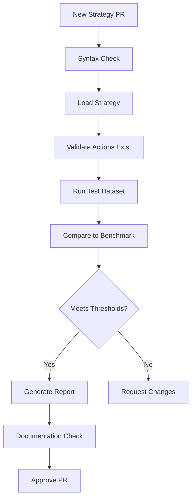

# Pull Request Validation Framework

## Overview

Every contribution to BioMapper must pass through a comprehensive validation pipeline that ensures code quality, scientific accuracy, and platform integrity. This framework validates not just strategies, but all types of contributions including new actions, bug fixes, documentation, and infrastructure changes.

## Validation Levels

### Level 1: Code Quality (All PRs)
- **Automated Checks**
  - Linting (ruff)
  - Type checking (mypy)
  - Code formatting (ruff format)
  - Security scanning (bandit, safety)
  - License compliance

### Level 2: Functional Testing (Code Changes)
- **Unit Tests**
  - Minimum 80% coverage for new code
  - All existing tests must pass
  - Edge cases documented and tested
- **Integration Tests**
  - End-to-end workflow validation
  - API endpoint testing
  - Database migration verification

### Level 3: Scientific Validation (Actions/Strategies)
- **Biological Correctness**
  - Handles many-to-many relationships
  - Processes composite identifiers
  - Maintains organism consistency
- **Benchmark Validation**
  - Compare against gold standards
  - Statistical metrics meet thresholds
  - Visual inspection of results

### Level 4: Performance Validation (All Changes)
- **Resource Usage**
  - Memory profiling
  - Execution time benchmarks
  - Scalability testing
- **Regression Testing**
  - No performance degradation
  - Backward compatibility maintained

## PR Types and Required Validations

### 1. New Strategy Contributions

```yaml
# .github/validation/strategy_requirements.yaml
strategy_validation:
  required_checks:
    - syntax_validation
    - action_availability
    - parameter_validation
    - benchmark_testing
    - documentation_complete
    
  benchmark_requirements:
    minimum_correlation: 0.90
    minimum_sensitivity: 0.85
    minimum_specificity: 0.85
    
  documentation_requirements:
    - strategy_description
    - parameter_explanations
    - expected_outcomes
    - validation_results
    - usage_examples
```

**Validation Workflow:**


### 2. New Action Contributions

```python
# Required validation for new actions
class ActionValidationRequirements:
    """Validation requirements for new action PRs."""
    
    def validate_action_pr(self, pr_files):
        checks = {
            "has_type_hints": self.check_type_hints(),
            "has_pydantic_models": self.check_pydantic_models(),
            "has_unit_tests": self.check_unit_tests(),
            "has_integration_tests": self.check_integration_tests(),
            "handles_edge_cases": self.check_edge_case_handling(),
            "has_documentation": self.check_documentation(),
            "registered_properly": self.check_registration(),
            "biological_validation": self.check_biological_correctness()
        }
        
        return all(checks.values()), checks
```

**Required Test Coverage:**
```python
# tests/test_new_action.py
class TestNewAction:
    def test_empty_input(self):
        """Must handle empty input gracefully."""
        
    def test_composite_identifiers(self):
        """Must handle composite IDs like Q14213_Q8NEV9."""
        
    def test_many_to_many_mapping(self):
        """Must support many-to-many relationships."""
        
    def test_missing_data(self):
        """Must handle missing/null values."""
        
    def test_large_dataset(self):
        """Must handle datasets >10000 items efficiently."""
        
    def test_biological_consistency(self):
        """Must maintain biological rules."""
        
    def test_provenance_tracking(self):
        """Must track all transformations."""
```

### 3. Bug Fix Contributions

```yaml
# Bug fix validation requirements
bug_fix_validation:
  required:
    - regression_test_added
    - root_cause_documented
    - existing_tests_pass
    - no_new_issues_introduced
    
  verification:
    - reproduce_original_issue
    - verify_fix_resolves_issue
    - check_edge_cases
    - performance_impact_assessment
```

### 4. Documentation Contributions

```yaml
# Documentation validation
documentation_validation:
  required:
    - spell_check
    - link_validation
    - code_example_testing
    - scientific_accuracy_review
    
  style_guide:
    - clear_headings
    - consistent_formatting
    - working_examples
    - proper_citations
```

## Automated Validation Pipeline

### GitHub Actions Workflow

```yaml
# .github/workflows/pr_validation.yml
name: PR Validation Pipeline

on:
  pull_request:
    types: [opened, synchronize, reopened]

jobs:
  # Level 1: Code Quality
  code_quality:
    runs-on: ubuntu-latest
    steps:
      - uses: actions/checkout@v3
      
      - name: Set up Python
        uses: actions/setup-python@v4
        with:
          python-version: '3.11'
          
      - name: Install Poetry
        run: |
          curl -sSL https://install.python-poetry.org | python3 -
          
      - name: Install dependencies
        run: poetry install --with dev
        
      - name: Run linting
        run: poetry run ruff check .
        
      - name: Check formatting
        run: poetry run ruff format --check .
        
      - name: Type checking
        run: poetry run mypy biomapper
        
      - name: Security scan
        run: |
          poetry run bandit -r biomapper
          poetry run safety check

  # Level 2: Functional Testing
  functional_tests:
    runs-on: ubuntu-latest
    needs: code_quality
    steps:
      - uses: actions/checkout@v3
      
      - name: Run unit tests with coverage
        run: |
          poetry run pytest tests/unit/ --cov=biomapper --cov-report=xml
          
      - name: Check coverage threshold
        run: |
          coverage_percent=$(poetry run coverage report | grep TOTAL | awk '{print $4}' | sed 's/%//')
          if (( $(echo "$coverage_percent < 80" | bc -l) )); then
            echo "Coverage $coverage_percent% is below 80% threshold"
            exit 1
          fi
          
      - name: Run integration tests
        run: poetry run pytest tests/integration/

  # Level 3: Scientific Validation (for strategies/actions)
  scientific_validation:
    runs-on: ubuntu-latest
    needs: functional_tests
    if: |
      contains(github.event.pull_request.files, 'strategy_actions/') ||
      contains(github.event.pull_request.files, 'strategies/')
    steps:
      - name: Validate new strategies
        run: |
          poetry run python scripts/validate_strategies.py \
            --pr-files ${{ github.event.pull_request.files }}
            
      - name: Run benchmark validation
        run: |
          poetry run python scripts/benchmark_validation.py \
            --strategy-path configs/strategies/ \
            --benchmark-data data/benchmarks/
            
      - name: Generate validation report
        run: |
          poetry run python scripts/generate_validation_report.py \
            --output pr_validation_report.html
            
      - name: Upload validation report
        uses: actions/upload-artifact@v3
        with:
          name: validation-report
          path: pr_validation_report.html
          
      - name: Comment PR with results
        uses: actions/github-script@v6
        with:
          script: |
            const fs = require('fs');
            const report = fs.readFileSync('pr_validation_summary.md', 'utf8');
            github.rest.issues.createComment({
              issue_number: context.issue.number,
              owner: context.repo.owner,
              repo: context.repo.repo,
              body: report
            });

  # Level 4: Performance Validation
  performance_validation:
    runs-on: ubuntu-latest
    needs: functional_tests
    steps:
      - name: Run performance benchmarks
        run: |
          poetry run python scripts/performance_benchmarks.py \
            --compare-to main
            
      - name: Memory profiling
        run: |
          poetry run python -m memory_profiler scripts/memory_test.py
          
      - name: Check for regressions
        run: |
          poetry run python scripts/check_performance_regression.py \
            --threshold 10  # Allow 10% degradation max

  # Strategy-specific validation
  strategy_validation:
    runs-on: ubuntu-latest
    needs: code_quality
    if: contains(github.event.pull_request.files, 'strategies/')
    steps:
      - name: Extract strategy files
        id: get_strategies
        run: |
          echo "strategies=$(git diff --name-only origin/main...HEAD | grep 'strategies.*yaml$' | tr '\n' ' ')" >> $GITHUB_OUTPUT
          
      - name: Validate each strategy
        run: |
          for strategy in ${{ steps.get_strategies.outputs.strategies }}; do
            echo "Validating $strategy"
            poetry run python scripts/validate_single_strategy.py \
              --strategy $strategy \
              --benchmarks data/benchmarks/
          done
          
      - name: Test strategy reproducibility
        run: |
          poetry run python scripts/test_reproducibility.py \
            --strategies "${{ steps.get_strategies.outputs.strategies }}" \
            --iterations 3

  # Documentation validation
  documentation_validation:
    runs-on: ubuntu-latest
    if: contains(github.event.pull_request.files, '.md')
    steps:
      - name: Spell check
        uses: streetsidesoftware/cspell-action@v2
        
      - name: Check links
        uses: gaurav-nelson/github-action-markdown-link-check@v1
        
      - name: Validate code examples
        run: |
          poetry run python scripts/validate_doc_examples.py
```

## Validation Scripts

### Strategy Validator

```python
# scripts/validate_single_strategy.py
import yaml
import argparse
from pathlib import Path
from biomapper.core.minimal_strategy_service import MinimalStrategyService
from biomapper.validation import BenchmarkValidator

def validate_strategy(strategy_path: Path, benchmark_dir: Path):
    """Validate a single strategy against benchmarks."""
    
    # Load strategy
    with open(strategy_path) as f:
        strategy = yaml.safe_load(f)
    
    # Check required fields
    required_fields = ['name', 'description', 'actions']
    for field in required_fields:
        if field not in strategy:
            raise ValueError(f"Strategy missing required field: {field}")
    
    # Validate actions exist
    service = MinimalStrategyService()
    for action in strategy['actions']:
        if action['action_type'] not in service.get_available_actions():
            raise ValueError(f"Unknown action: {action['action_type']}")
    
    # Run benchmark validation
    validator = BenchmarkValidator()
    results = validator.validate_strategy(
        strategy=strategy,
        benchmark_data=benchmark_dir / f"{strategy['name']}_benchmark.csv"
    )
    
    # Check thresholds
    if results['correlation'] < 0.90:
        raise ValueError(f"Correlation {results['correlation']} below 0.90 threshold")
    
    if results['sensitivity'] < 0.85:
        raise ValueError(f"Sensitivity {results['sensitivity']} below 0.85 threshold")
    
    return results
```

### Action Validator

```python
# scripts/validate_new_action.py
import ast
import inspect
from pathlib import Path

class ActionValidator:
    """Validates new action contributions."""
    
    def validate_action_file(self, file_path: Path):
        """Validate an action implementation file."""
        
        with open(file_path) as f:
            tree = ast.parse(f.read())
        
        validations = {
            "has_register_decorator": self._check_register_decorator(tree),
            "has_typed_base": self._check_typed_base(tree),
            "has_pydantic_models": self._check_pydantic_models(tree),
            "has_execute_typed": self._check_execute_typed(tree),
            "has_docstrings": self._check_docstrings(tree),
            "handles_edge_cases": self._check_edge_cases(tree)
        }
        
        # Check for corresponding test file
        test_file = Path("tests/unit/strategy_actions") / f"test_{file_path.name}"
        validations["has_tests"] = test_file.exists()
        
        if test_file.exists():
            validations["test_coverage"] = self._check_test_coverage(test_file)
        
        return all(validations.values()), validations
    
    def _check_register_decorator(self, tree):
        """Check if action uses @register_action decorator."""
        for node in ast.walk(tree):
            if isinstance(node, ast.ClassDef):
                for decorator in node.decorator_list:
                    if isinstance(decorator, ast.Call):
                        if hasattr(decorator.func, 'id') and decorator.func.id == 'register_action':
                            return True
        return False
```

## PR Review Checklist

### Automated Checks ✅
- [ ] All CI/CD checks passing
- [ ] Code coverage ≥ 80%
- [ ] No security vulnerabilities
- [ ] Performance benchmarks pass
- [ ] Type checking passes

### Manual Review Required
- [ ] Biological assumptions documented
- [ ] Error messages are informative
- [ ] Logging at appropriate levels
- [ ] Backward compatibility maintained
- [ ] Documentation updated

### For Strategy PRs
- [ ] Validation results included
- [ ] Benchmark data provided
- [ ] Usage examples work
- [ ] Expected outcomes documented
- [ ] Reproducibility tested

### For Action PRs
- [ ] Handles all edge cases
- [ ] Many-to-many support
- [ ] Composite ID handling
- [ ] Provenance tracking complete
- [ ] Integration with existing actions tested

## Validation Report Template

```markdown
# PR Validation Report

## Summary
- **PR Type**: [Strategy|Action|Bug Fix|Documentation|Infrastructure]
- **Validation Status**: [Passed|Failed|Needs Review]
- **Trust Score**: [0-100]

## Code Quality
- Linting: ✅ Passed
- Type Checking: ✅ Passed
- Formatting: ✅ Passed
- Security: ✅ No issues

## Test Results
- Unit Tests: 95% coverage (523 passed, 0 failed)
- Integration Tests: 48 passed, 0 failed
- Performance: No regression detected

## Scientific Validation (if applicable)
### Benchmark Comparison
| Metric | BioMapper | Gold Standard | Threshold | Status |
|--------|-----------|---------------|-----------|--------|
| Correlation | 0.97 | - | 0.90 | ✅ |
| Sensitivity | 0.92 | 0.93 | 0.85 | ✅ |
| Specificity | 0.89 | 0.91 | 0.85 | ✅ |

### Biological Validation
- Handles composite identifiers: ✅
- Many-to-many mappings: ✅
- Organism consistency: ✅
- Nomenclature variations: ✅

## Recommendations
- [Specific feedback for improvement]
- [Suggestions for optimization]
- [Documentation needs]

## Approval Requirements
- [ ] 2 code reviews from maintainers
- [ ] Scientific review (for strategies/actions)
- [ ] Performance review (for core changes)
- [ ] Documentation review

---
Generated: [timestamp]
```

## Special Validation Cases

### Breaking Changes
```yaml
breaking_change_validation:
  required_approvals: 3
  migration_guide: required
  deprecation_notice: required
  compatibility_layer: recommended
  version_bump: major
```

### Emergency Hotfixes
```yaml
hotfix_validation:
  expedited: true
  minimum_tests: regression_only
  required_approvals: 1
  post_merge_validation: required
```

### External Contributions
```yaml
external_contribution_validation:
  cla_signed: required
  extra_scrutiny: true
  benchmark_validation: mandatory
  documentation: comprehensive
  mentor_assigned: true
```

## Continuous Improvement

### Metrics Tracked
- PR validation time
- False positive rate
- Validation accuracy
- Contributor satisfaction
- Time to merge

### Feedback Loop
1. Collect validation metrics
2. Analyze failure patterns
3. Update validation rules
4. Improve automation
5. Document lessons learned

## Conclusion

This comprehensive PR validation framework ensures that every contribution to BioMapper maintains the highest standards of code quality, scientific accuracy, and platform integrity. By automating validation where possible and providing clear guidelines for manual review, we accelerate development while maintaining trust.