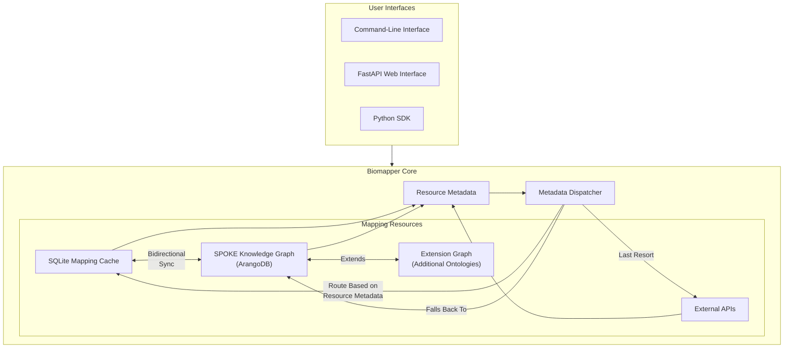

# Biomapper

A unified Python toolkit for biological data harmonization and ontology mapping. `biomapper` provides a single interface for standardizing identifiers and mapping between various biological ontologies, making multi-omic data integration more accessible and reproducible.

[Documentation](https://biomapper.readthedocs.io/) | [Examples](examples/) | [Contributing](CONTRIBUTING.md)

## Architecture Overview



## Features

### Core Functionality
- **ID Standardization**: Unified interface for standardizing biological identifiers
- **Ontology Mapping**: Comprehensive ontology mapping using major biological databases and AI-powered techniques
- **High-Performance Caching**: SQLite-based mapping cache with bidirectional transitivity 
- **Knowledge Graph Integration**: Seamless integration with SPOKE graph database
- **Intelligent Resource Routing**: Metadata-driven orchestration of mapping resources
- **Data Validation**: Robust validation of input data and mappings
- **Extensible Architecture**: Easy integration of new data sources and mapping services

### Supported Systems

#### Knowledge Graph & Caching
- **SPOKE**: Integration with the Scalable Precision Medicine Open Knowledge Engine
- **SQLite Mapping Cache**: High-performance local caching with bidirectional transitivity

#### ID Standardization Tools
- **RaMP-DB**: Integration with the Rapid Mapping Database for metabolites and pathways

#### Mapping Services
- **ChEBI**: Chemical Entities of Biological Interest database integration
- **UniChem**: Cross-referencing of chemical structure identifiers
- **UniProt**: Protein-focused mapping capabilities
- **RefMet**: Reference list of metabolite names and identifiers
- **RAG-Based Mapping**: AI-powered mapping using Retrieval Augmented Generation
- **Multi-Provider RAG**: Combining multiple data sources for improved mapping accuracy

## Installation

### Using pip
```bash
pip install biomapper
```

### Development Setup

1. Clone the repository:
```bash
git clone https://github.com/arpanauts/biomapper.git
cd biomapper
```

2. Install Python 3.11 with pyenv (if not already installed):
```bash
# Install pyenv dependencies
sudo apt-get update
sudo apt-get install -y make build-essential libssl-dev zlib1g-dev \
libbz2-dev libreadline-dev libsqlite3-dev wget curl llvm libncurses5-dev \
libncursesw5-dev xz-utils tk-dev libffi-dev liblzma-dev python3-openssl

# Install pyenv
curl https://pyenv.run | bash

# Add to your shell configuration
echo 'export PYENV_ROOT="$HOME/.pyenv"' >> ~/.bashrc
echo 'command -v pyenv >/dev/null || export PATH="$PYENV_ROOT/bin:$PATH"' >> ~/.bashrc
echo 'eval "$(pyenv init -)"' >> ~/.bashrc

# Reload shell configuration
source ~/.bashrc

# Install Python 3.11
pyenv install 3.11
pyenv local 3.11
```

3. Install Poetry (if not already installed):
```bash
curl -sSL https://install.python-poetry.org | python3 -
```

4. Install project dependencies:
```bash
poetry install
```

5. Set up pre-commit hooks:
```bash
poetry run pre-commit install
```

### Running Examples

The `examples/` directory contains tutorials and utility scripts demonstrating various features of biomapper. Before running examples:

1. Install additional dependencies:
```bash
poetry install --with examples
```

2. Set up environment variables:
```bash
# Create a .env file from the template
cp .env.example .env

# Edit .env with your API keys and configurations
vim .env
```

3. Initialize the vector store:
```bash
# Create the vector store directory
mkdir -p vector_store

# Run the setup script
poetry run python examples/utilities/verify_chromadb_setup.py
```

4. Run an example:
```bash
poetry run python examples/tutorials/tutorial_basic_llm_mapping.py
```

Refer to the [examples documentation](examples/README.md) for detailed information about each example.
```

## Project Structure

```
biomapper/
├── biomapper/          # Main package source code
├── docs/              # Documentation
│   ├── source/        # Sphinx documentation source
│   │   ├── api/       # API reference
│   │   ├── guides/    # User guides
│   │   └── tutorials/ # Tutorial documentation
│   └── technical_notes/# Technical design notes
├── examples/          # Example scripts and tutorials
│   ├── tutorials/     # Step-by-step tutorials
│   └── utilities/     # Utility scripts
├── tests/             # Test suite
├── poetry.lock       # Poetry dependency lock file
├── pyproject.toml    # Project configuration
└── README.md         # This file
```

## Documentation

Full documentation is available at [biomapper.readthedocs.io](https://biomapper.readthedocs.io/), including:

- Getting Started Guide
- API Reference
- Tutorials
- Architecture Overview
- Example Scripts


## Contributing

Contributions are welcome! Please see our [Contributing Guide](CONTRIBUTING.md) for details.


## License

This project is licensed under the MIT License - see the [LICENSE](LICENSE) file for details.


## Roadmap

- [x] Initial release with core functionality
- [x] Implement RAG-based mapping capabilities
- [x] Add support for major chemical/biological databases (ChEBI, UniChem, UniProt)
- [x] Implement SQLite mapping cache with bidirectional transitivity
- [x] Develop SPOKE knowledge graph integration with bidirectional sync
- [x] Create resource metadata system for intelligent operation routing
- [ ] Develop comprehensive RAG performance evaluation framework
- [ ] Establish gold-standard benchmarks for ontological mapping
- [ ] Enhance RAG-based mapping with additional data sources
- [ ] Improve compound name normalization
- [ ] Implement FastAPI web interface for mapping operations
- [ ] Add support for pathway databases (KEGG, Reactome)
- [ ] Integrate with biomedical datasets (Arivale, UKBB)
- [ ] Expand test coverage and documentation


## Project Structure

```
biomapper/
├── biomapper/                # Main package directory
│   ├── core/                # Core abstract classes and base functionality
│   ├── cache/               # Mapping cache components
│   │   ├── manager.py      # Cache manager implementation
│   │   ├── mapper.py       # Cache-aware entity mapper
│   │   ├── config.py       # Cache configuration 
│   │   ├── monitoring.py   # Performance monitoring
│   │   └── cli.py          # Command-line interface
│   ├── db/                  # Database components
│   │   ├── models.py       # SQLAlchemy ORM models
│   │   ├── models_metadata.py # Resource metadata models
│   │   ├── session.py      # Database connection management
│   │   └── maintenance.py  # Database maintenance utilities
│   ├── transitivity/       # Transitivity components
│   │   ├── builder.py      # Transitive relationship builder
│   │   └── confidence.py   # Confidence propagation
│   ├── integration/        # Integration with external systems
│   │   └── spoke_cache_sync.py # SPOKE-cache synchronization
│   ├── metadata/           # Resource metadata system
│   │   ├── manager.py      # Resource metadata manager
│   │   └── dispatcher.py   # Mapping operation dispatcher
│   ├── spoke/              # SPOKE knowledge graph components
│   ├── standardization/    # ID standardization components
│   ├── mapping/            # Ontology mapping components
│   │   ├── clients/        # Database API clients
│   │   └── rag/            # RAG-based mapping components
│   ├── utils/              # Utility functions
│   └── schemas/            # Data schemas and models
├── db/                     # Database migration scripts
│   └── migrations/         # Alembic migration files
├── tests/                  # Test suite
├── docs/                   # Documentation
├── roadmap/                # Implementation plans and roadmap
├── examples/               # Example scripts
├── scripts/                # Utility scripts
├── pyproject.toml          # Poetry configuration and dependencies
└── poetry.lock            # Lock file for dependencies
```

## License

This project is licensed under the Apache 2.0 License - see the [LICENSE](LICENSE) file for details.

## Support

For support, please open an issue in the GitHub issue tracker.

## Roadmap

- [x] Initial release with core functionality
- [x] Implement RAG-based mapping capabilities
- [x] Add support for major chemical/biological databases (ChEBI, UniChem, UniProt)
- [ ] Add caching layer for improved performance
- [ ] Expand RAG capabilities with more specialized models
- [ ] Add batch processing capabilities
- [ ] Develop REST API interface

## Acknowledgments

- [RaMP-DB](http://rampdb.org/)
- [ChEBI](https://www.ebi.ac.uk/chebi/)
- [UniChem](https://www.ebi.ac.uk/unichem/)
- [UniProt](https://www.uniprot.org/)
- [RefMet](https://refmet.metabolomicsworkbench.org/)