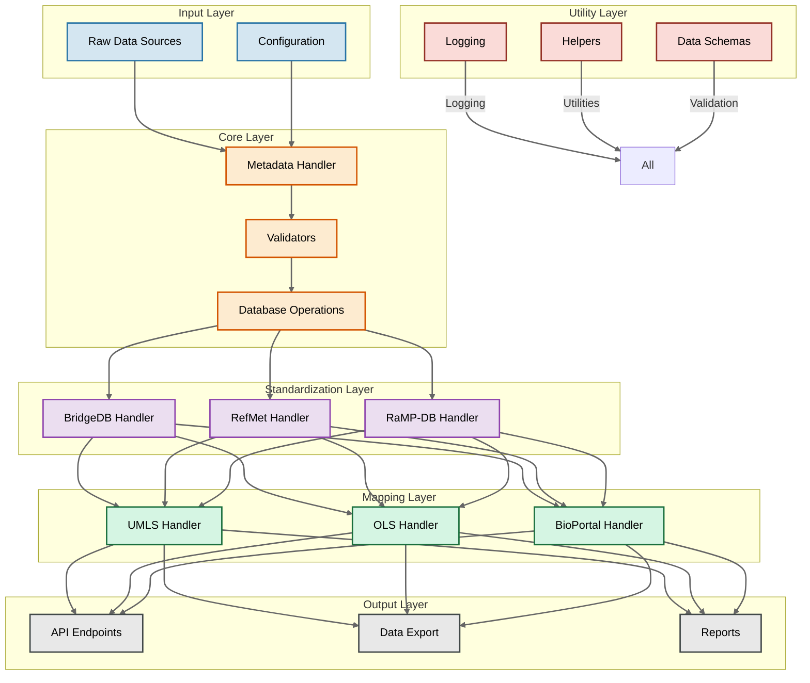

# biomapper

A unified Python toolkit for biological data harmonization and ontology mapping. `biomapper` provides a single interface for standardizing identifiers and mapping between various biological ontologies, making multi-omic data integration more accessible and reproducible.

## Architecture



## Features

### Core Functionality
- **ID Standardization**: Unified interface for standardizing biological identifiers
- **Ontology Mapping**: Comprehensive ontology mapping using major biological databases
- **Data Validation**: Robust validation of input data and mappings
- **Extensible Architecture**: Easy integration of new data sources and mapping services

### Supported Systems

#### ID Standardization Tools
- BridgeDb
- RefMet
- RaMP-DB

#### Ontology Mapping Services
- UMLS Metathesaurus
- Ontology Lookup Service (OLS)
- BioPortal

## Installation

```bash
# Create virtual environment
python -m venv venv
source venv/bin/activate  # On Windows use: venv\Scripts\activate

# Install for development
pip install -e .

# Install development dependencies
pip install -r requirements-dev.txt
```

## Quick Start

```python
from biomapper import AnalyteMetadata
from biomapper.standardization import BridgeDBHandler

# Initialize metadata handler
metadata = AnalyteMetadata()

# Create standardization handler
bridge_handler = BridgeDBHandler()

# Process identifiers
results = bridge_handler.standardize(["P12345", "Q67890"])
```

## Development Setup

1. Clone the repository
```bash
git clone https://github.com/yourusername/biomapper.git
cd biomapper
```

2. Set up development environment
```bash
# Create virtual environment
python -m venv venv
source venv/bin/activate

# Install development dependencies
pip install -r requirements-dev.txt
```

3. Run tests
```bash
pytest
```

## Project Structure

```
biomapper/
├── annotation_engine/        # Main package directory
│   ├── core/               # Core functionality
│   ├── standardization/    # ID standardization components
│   ├── mapping/           # Ontology mapping components
│   ├── utils/            # Utility functions
│   └── schemas/         # Data schemas and models
├── tests/               # Test files
├── docs/               # Documentation
└── scripts/           # Utility scripts
```

## Contributing

We welcome contributions! Please see our [Contributing Guide](CONTRIBUTING.md) for details.

1. Fork the repository
2. Create your feature branch (`git checkout -b feature/amazing-feature`)
3. Commit your changes (`git commit -m 'Add some amazing feature'`)
4. Push to the branch (`git push origin feature/amazing-feature`)
5. Open a Pull Request

## Testing

Run the test suite:
```bash
pytest
```

With coverage:
```bash
pytest --cov=biomapper
```

## License

This project is licensed under the MIT License - see the [LICENSE](LICENSE) file for details.

## Support

For support, please open an issue in the GitHub issue tracker.

## Roadmap

- [ ] Initial release with core functionality
- [ ] Add support for additional ontology services
- [ ] Implement caching layer
- [ ] Add batch processing capabilities
- [ ] Develop REST API interface

## Acknowledgments

- [BridgeDb](https://www.bridgedb.org/)
- [RefMet](https://refmet.metabolomicsworkbench.org/)
- [RaMP-DB](http://rampdb.org/)
- [UMLS](https://www.nlm.nih.gov/research/umls/index.html)
- [OLS](https://www.ebi.ac.uk/ols/index)
- [BioPortal](https://bioportal.bioontology.org/)
