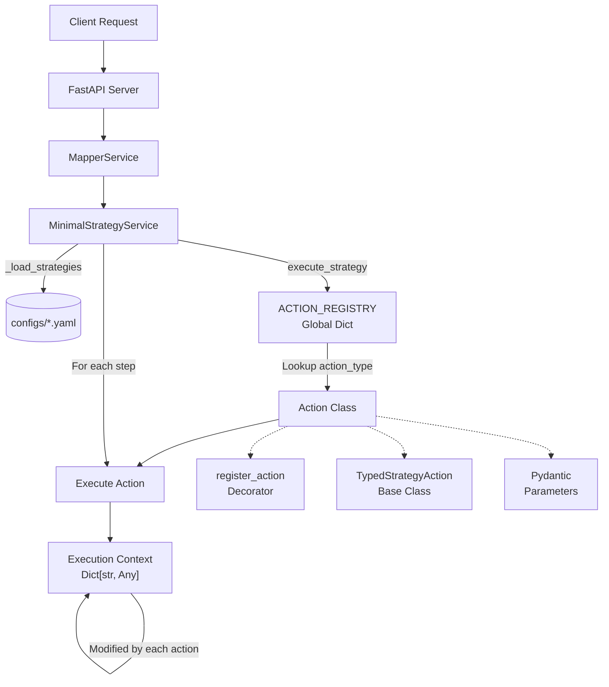

# BioMapper

[](https://www.python.org/downloads/)
[](https://codecov.io/gh/biomapper/biomapper)
[](LICENSE)
[](https://github.com/astral-sh/ruff)

BioMapper is a general-purpose bioinformatics workflow platform built around an extensible action system and YAML-based strategy configuration. Developers can use Claude Code to help write and debug these workflows - creating new actions, troubleshooting errors, and optimizing parameters - making it the first bioinformatics platform designed with AI-assisted development in mind. While biological data harmonization (matching metabolites, proteins, etc. across databases) is its current primary use case, the architecture supports any workflow that can be expressed as a sequence of actions operating on a shared execution context.

## Architecture



### Key Components

1. **FastAPI Server**: REST API layer that handles HTTP requests and routes them to the appropriate services. Provides endpoints for strategy execution, file uploads, and result retrieval.

2. **MapperService**: High-level service that orchestrates mapping operations. It manages background jobs, processes CSV files, and coordinates between the API layer and the core strategy execution engine.

3. **MinimalStrategyService**: Core strategy execution engine that:
   - Loads YAML strategy files from the `configs/` directory at initialization
   - Maintains an internal registry of available actions
   - Executes strategies step-by-step by instantiating and running action classes
   - Manages the execution context throughout the workflow

4. **ACTION_REGISTRY**: Global dictionary (`Dict[str, Type]`) that stores mappings from action names (strings) to action classes. Actions self-register using the `@register_action` decorator when their modules are imported.

5. **Execution Context**: Simple dictionary (`Dict[str, Any]`) that flows through the action pipeline:
   - Contains `current_identifiers`, `datasets`, `statistics`, `output_files`
   - Each action reads from and modifies this shared state
   - Enables actions to build upon previous results in the pipeline

6. **Action Classes**: Self-contained processing units that:
   - Inherit from `TypedStrategyAction` for type safety and standardized interfaces
   - Use Pydantic models for parameter validation and result structures
   - Implement domain-specific logic (fuzzy matching, API calls, validation)
   - Register themselves via `@register_action("ACTION_NAME")` decorator

7. **YAML Strategies**: Configuration files that define workflows as sequences of actions:
   - Specify action types, parameters, and execution order
   - Support variable substitution (e.g., `${DATA_DIR}`)
   - Enable declarative workflow definition without coding

## Installation

### Prerequisites
- Python 3.11+
- Poetry for dependency management
- Docker (optional, for Qdrant vector store)

### Setup

```bash
# Clone repository
git clone https://github.com/biomapper/biomapper.git
cd biomapper

# Install dependencies
poetry install --with dev,docs,api

# Activate environment
poetry shell

# Run tests
poetry run pytest
```

## Core Components

### Action System

BioMapper uses a registry-based action system. Actions are registered using decorators and implement standardized interfaces:

```python
from biomapper.core.strategy_actions import TypedStrategyAction, register_action
from pydantic import BaseModel

class MyActionParams(BaseModel):
    input_file: str
    threshold: float = 0.8

@register_action("MY_ACTION")
class MyAction(TypedStrategyAction[MyActionParams]):
    def get_params_model(self) -> type[MyActionParams]:
        return MyActionParams
    
    async def execute_typed(self, params: MyActionParams, context: Dict):
        # Implementation
        return result
```

### Available Actions

#### Data Loading
- `LOAD_DATASET_IDENTIFIERS` - Load biological identifiers from CSV/TSV files
- `BUILD_NIGHTINGALE_REFERENCE` - Build reference dataset for Nightingale NMR platform

#### Matching Actions
- `BASELINE_FUZZY_MATCH` - Fuzzy string matching for biological names
- `CTS_ENRICHED_MATCH` - Chemical Translation Service API matching
- `VECTOR_ENHANCED_MATCH` - Vector embedding-based semantic matching
- `NIGHTINGALE_NMR_MATCH` - Specialized matching for NMR metabolomics
- `SEMANTIC_METABOLITE_MATCH` - Semantic matching using metabolite ontologies

#### Processing Actions  
- `MERGE_DATASETS` - Combine multiple datasets with deduplication
- `CALCULATE_SET_OVERLAP` - Calculate Jaccard index and overlap statistics
- `CALCULATE_THREE_WAY_OVERLAP` - Three-way dataset comparison
- `COMBINE_METABOLITE_MATCHES` - Merge results from multiple matching strategies

#### Validation Actions
- `VALIDATE_AGAINST_REFERENCE` - Compare results to gold standard
- `GENERATE_ENHANCEMENT_REPORT` - Generate validation metrics report
- `GENERATE_METABOLOMICS_REPORT` - Domain-specific validation report

## Strategy Configuration

Strategies are defined in YAML files:

```yaml
name: METABOLOMICS_HARMONIZATION
description: Harmonize metabolomics data across platforms

parameters:
  input_file: "/data/metabolomics.csv"
  reference_file: "/data/reference.csv"
  output_dir: "/results"

actions:
  - action_type: LOAD_DATASET_IDENTIFIERS
    params:
      dataset_files:
        primary: "${input_file}"
      identifier_column: "metabolite_name"
      
  - action_type: BASELINE_FUZZY_MATCH
    params:
      fuzzy_threshold: 0.82
      save_results: true
      
  - action_type: CTS_ENRICHED_MATCH
    params:
      rate_limit: 10
      cache_results: true
      
  - action_type: VALIDATE_AGAINST_REFERENCE
    params:
      reference_file: "${reference_file}"
      metrics: ["correlation", "sensitivity", "specificity"]
      generate_certificate: true
```

## Validation Framework

### Validation Levels

1. **Unit Tests** - Individual action validation
2. **Integration Tests** - Complete workflow validation  
3. **Reference Validation** - Comparison against gold standards

### Validation Metrics

```python
# Example validation output
{
    "correlation": 0.97,
    "sensitivity": 0.92,
    "specificity": 0.89,
    "jaccard_index": 0.73,
    "match_rate": 0.85
}
```

### Running Validation

```bash
# Validate a strategy
poetry run python scripts/validate_single_strategy.py \
  --strategy configs/strategies/metabolomics.yaml \
  --benchmarks data/benchmarks/

# Run benchmark suite
poetry run python scripts/benchmark_validation.py \
  --output validation_report.html
```

## API Usage

### Starting the API Server

```bash
cd biomapper-api
poetry run uvicorn app.main:app --reload
```

### Python Client

```python
from biomapper_client import BiomapperClient
import asyncio

async def run_strategy():
    async with BiomapperClient(base_url="http://localhost:8000") as client:
        # Execute strategy
        result = await client.execute_strategy_file(
            "configs/strategies/metabolomics.yaml"
        )
        
        # Check validation
        if result.get("validation", {}).get("passed"):
            print(f"Validation passed: {result['validation']['metrics']}")
        
        return result

asyncio.run(run_strategy())
```

## Development

### Running Tests

```bash
# All tests
poetry run pytest

# Unit tests only
poetry run pytest tests/unit/

# With coverage
poetry run pytest --cov=biomapper --cov-report=html

# Specific test file
poetry run pytest tests/unit/strategy_actions/test_fuzzy_match.py
```

### Code Quality

```bash
# Linting
poetry run ruff check .

# Formatting
poetry run ruff format .

# Type checking
poetry run mypy biomapper
```

### Creating New Actions

1. Create action file in `biomapper/core/strategy_actions/`
2. Implement `TypedStrategyAction` interface
3. Add tests in `tests/unit/strategy_actions/`
4. Register with `@register_action` decorator

Example structure:
```python
# biomapper/core/strategy_actions/my_action.py
@register_action("MY_ACTION")
class MyAction(TypedStrategyAction[MyParams, MyResult]):
    """Action description."""
    
    def get_params_model(self) -> type[MyParams]:
        return MyParams
    
    async def execute_typed(self, params: MyParams, context: Dict) -> MyResult:
        # Handle composite identifiers
        # Support many-to-many mappings
        # Track provenance
        return result
```

## Documentation

- [Action Development Guide](.claude/BIOLOGICAL_ACTIONS.md)
- [Validation Framework](.claude/VALIDATION_FRAMEWORK.md)
- [Strategy Examples](configs/strategies/)


## License

Apache License 2.0 - see [LICENSE](LICENSE) for details.