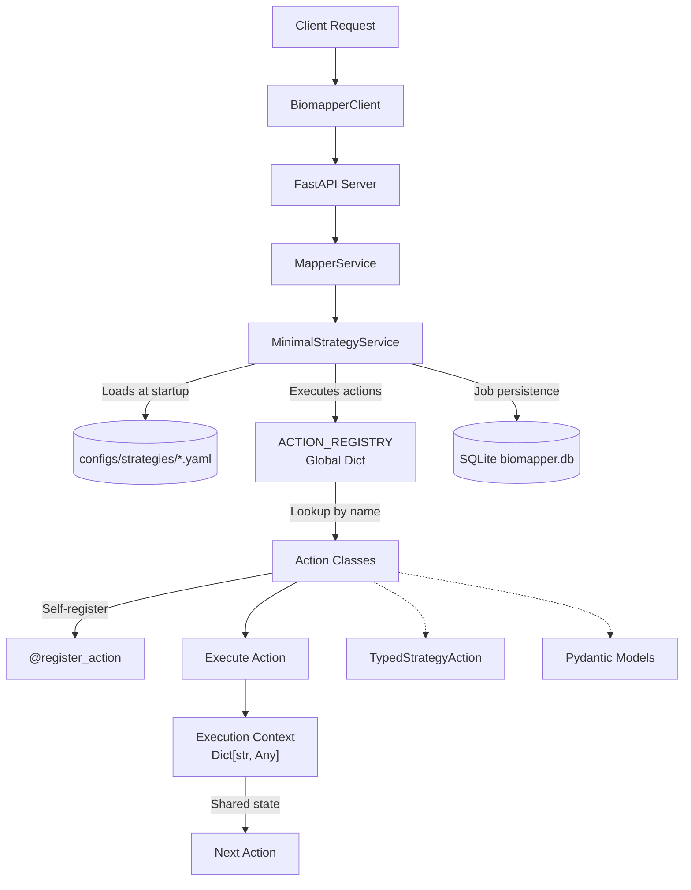

# BioMapper

[](https://www.python.org/downloads/)
[](https://python-poetry.org/)
[](https://github.com/astral-sh/ruff)
[](LICENSE)

BioMapper is a general-purpose plugin- and strategy-based orchestration framework, with its first application in biological data harmonization. Architecturally, it blends elements of workflow engines (Nextflow, Snakemake, Kedro, Dagster) with a lightweight service-oriented API and a plugin registry backed by a unified UniversalContext. Its standout differentiator is an AI-native developer experience: CLAUDE.md, .claude/ scaffolding, custom slash commands, and the BioSherpa guide. This arguably makes it the first open-source orchestration platform with built-in LLM-assisted contributor workflows.

The result is a platform that is modular, extensible, and uniquely AI-augmented, well-positioned for long-term ecosystem growth. Built on a self-registering action system and YAML-based workflow definitions, it features a modern src-layout architecture with comprehensive test coverage and 2025 standardizations for production reliability.

## 🎯 Key Features

- **Self-registering action system** - Actions automatically register via decorators
- **Type-safe parameters** - Pydantic models provide validation and IDE support
- **YAML workflow definition** - Declarative strategies without coding
- **Real-time progress tracking** - SSE events for long-running jobs
- **Extensible architecture** - Easy to add new actions and entity types
- **AI-ready design** - Built for integration with Claude Code and LLM assistance

## 🏗️ Architecture

### Overview

BioMapper follows a modern microservices architecture with clear separation of concerns:

**Core Design:**
- **YAML Strategies** - Declarative configs defining pipelines of actions
- **Action Registry** - Self-registering via decorators; plug-and-play extensibility
- **UniversalContext** - Normalizes state access across heterogeneous action types
- **Pydantic Models (v2)** - Typed parameter models per action category
- **Progressive Mapping** - Iterative enrichment stages (65% → 80% coverage)

**Comparison to Known Patterns:**
- **Similar to:** Nextflow & Snakemake (declarative pipelines), Kedro (typed configs + reproducibility), Dagster (observability and orchestration)
- **Different from:** Heavy orchestrators (Airflow, Beam) — BioMapper is lighter, service/API-first, domain-agnostic, and tailored for interactive workflows
- **Unique:** Combines API service with strategy-based pipeline engine; domain-specific operations first (bio), but extensible beyond

**Three-Layer Design:**
1. **Client Layer** - Python client library (`src/client/`) provides programmatic access
2. **API Layer** - FastAPI service (`src/api/`) handles HTTP requests, job management, and background processing
3. **Core Layer** - Business logic (`src/core/`) with self-registering actions and strategy execution engine

**Key Architectural Patterns:**
- **Registry Pattern** - Actions self-register at import time using decorators, eliminating manual registration
- **Strategy Pattern** - YAML configurations define workflows as sequences of pluggable actions
- **Pipeline Pattern** - Actions process data through a shared execution context, enabling complex workflows
- **Type Safety** - Pydantic models provide runtime validation and compile-time type checking

**Data Flow:**
1. User defines a workflow in YAML (strategy) or calls the API directly
2. Client sends request to FastAPI server
3. Server validates request and creates a background job
4. MinimalStrategyService loads the strategy and executes actions sequentially
5. Each action reads from and writes to a shared execution context
6. Results persist to SQLite for recovery and progress tracking
7. Client receives results via REST response or Server-Sent Events (SSE)

**Design Principles:**
- **Modularity** - Each action is independent and reusable
- **Extensibility** - New actions can be added without modifying core code
- **Type Safety** - Strong typing prevents runtime errors
- **Reproducibility** - YAML strategies ensure consistent execution
- **Fault Tolerance** - Job persistence enables recovery from failures

### System Architecture Diagram



### Core Components

| Component | Description | Location |
|-----------|-------------|----------|
| **src/actions/** | Action implementations with entity-based organization | `src/actions/` |
| **src/api/** | FastAPI REST service | `src/api/` |
| **src/client/** | Python client library | `src/client/` |
| **ACTION_REGISTRY** | Global action registry | `src/actions/registry.py` |
| **MinimalStrategyService** | Strategy execution engine | `src/core/minimal_strategy_service.py` |

## 📦 Installation

### Prerequisites

- Python 3.11+
- Poetry for dependency management
- Git for version control

### Quick Start

```bash
# Clone repository
git clone https://github.com/biomapper/biomapper.git
cd biomapper

# Install dependencies with Poetry
poetry install --with dev,docs,api

# Activate virtual environment
poetry shell

# Run tests to verify installation
poetry run pytest

# Start the API server
poetry run uvicorn src.api.main:app --reload --port 8000
```

## 🚀 Usage

### Command Line Interface

```bash
# Basic CLI commands
poetry run biomapper --help
poetry run biomapper health
poetry run biomapper metadata list

# Check API health
curl http://localhost:8000/health

# Run a strategy via API
# (Use Python client or direct HTTP calls)
```

### Python Client

```python
from src.client.client_v2 import BiomapperClient

# Synchronous usage (recommended for scripts)
client = BiomapperClient(base_url="http://localhost:8000")
result = client.run("test_metabolite_simple", parameters={
    "input_file": "/data/metabolites.csv",
    "output_dir": "/results"
})
print(f"Results: {result}")

# Async usage (for integration)
import asyncio

async def run_async():
    async with BiomapperClient() as client:
        result = await client.execute_strategy(
            "test_metabolite_simple",
            parameters={"input_file": "/data/metabolites.csv"}
        )
        return result

asyncio.run(run_async())
```

### YAML Strategy Definition

Create strategies in `src/configs/strategies/`:

```yaml
name: metabolite_harmonization
description: Harmonize metabolite identifiers across platforms

parameters:
  input_file: "${DATA_DIR}/metabolites.tsv"
  output_dir: "${OUTPUT_DIR}"
  fuzzy_threshold: 0.85

steps:
  - name: load_metabolites
    action:
      type: LOAD_DATASET_IDENTIFIERS
      params:
        file_path: "${parameters.input_file}"
        identifier_column: "compound_name"
        output_key: "input_metabolites"

  - name: enrich_with_cts
    action:
      type: METABOLITE_CTS_BRIDGE
      params:
        input_key: "input_metabolites"
        output_key: "cts_enriched"
        from_format: "Chemical Name"
        to_format: "InChIKey"

  - name: export_results
    action:
      type: EXPORT_DATASET_V2
      params:
        input_key: "cts_enriched"
        output_file: "${parameters.output_dir}/harmonized.csv"
        format: "csv"
```

## 📚 Available Actions

### Data Operations
| Action | Description |
|--------|-------------|
| `LOAD_DATASET_IDENTIFIERS` | Load biological identifiers from CSV/TSV files |
| `MERGE_DATASETS` | Combine multiple datasets with deduplication |
| `FILTER_DATASET` | Apply filtering criteria to datasets |
| `EXPORT_DATASET_V2` | Export results to CSV/TSV/JSON formats |
| `CUSTOM_TRANSFORM_EXPRESSION` | Apply Python expressions to transform data |

### Protein Actions
| Action | Description |
|--------|-------------|
| `PROTEIN_EXTRACT_UNIPROT_FROM_XREFS` | Extract UniProt IDs from compound reference fields |
| `PROTEIN_NORMALIZE_ACCESSIONS` | Standardize protein accession formats |
| `PROTEIN_MULTI_BRIDGE` | Multi-source protein identifier resolution |
| `MERGE_WITH_UNIPROT_RESOLUTION` | Map identifiers to UniProt accessions |

### Metabolite Actions
| Action | Description |
|--------|-------------|
| `METABOLITE_CTS_BRIDGE` | Chemical Translation Service API integration |
| `METABOLITE_EXTRACT_IDENTIFIERS` | Extract metabolite IDs from text fields |
| `METABOLITE_NORMALIZE_HMDB` | Standardize HMDB identifier formats |
| `METABOLITE_MULTI_BRIDGE` | Multi-database metabolite resolution |
| `NIGHTINGALE_NMR_MATCH` | Nightingale NMR platform matching |
| `SEMANTIC_METABOLITE_MATCH` | AI-powered semantic matching |
| `VECTOR_ENHANCED_MATCH` | Vector embedding similarity matching |
| `METABOLITE_API_ENRICHMENT` | Enrich via external metabolite APIs |
| `COMBINE_METABOLITE_MATCHES` | Merge results from multiple strategies |

### Chemistry Actions
| Action | Description |
|--------|-------------|
| `CHEMISTRY_EXTRACT_LOINC` | Extract LOINC codes from clinical data |
| `CHEMISTRY_FUZZY_TEST_MATCH` | Fuzzy matching for clinical test names |
| `CHEMISTRY_VENDOR_HARMONIZATION` | Harmonize vendor-specific test codes |
| `CHEMISTRY_TO_PHENOTYPE_BRIDGE` | Link chemistry results to phenotypes |

### Analysis & Reporting
| Action | Description |
|--------|-------------|
| `CALCULATE_SET_OVERLAP` | Calculate Jaccard similarity between datasets |
| `CALCULATE_THREE_WAY_OVERLAP` | Three-way dataset comparison analysis |
| `CALCULATE_MAPPING_QUALITY` | Assess mapping quality metrics |
| `GENERATE_METABOLOMICS_REPORT` | Generate comprehensive metabolomics reports |
| `GENERATE_ENHANCEMENT_REPORT` | Create validation and enhancement reports |

### IO & Integration
| Action | Description |
|--------|-------------|
| `SYNC_TO_GOOGLE_DRIVE_V2` | Upload results to Google Drive |
| `CHUNK_PROCESSOR` | Process large datasets in chunks |

## 🧪 Development

### Creating New Actions

Follow Test-Driven Development (TDD) approach:

```python
# 1. Write test first (tests/unit/actions/test_my_action.py)
import pytest
from src.actions.my_action import MyAction, MyActionParams
from src.core.exceptions import ActionResult

async def test_my_action():
    params = MyActionParams(input_key="test", threshold=0.8)
    context = {"datasets": {"test": [{"id": "1", "name": "test", "score": 0.9}]}}
    
    action = MyAction()
    result = await action.execute_typed(params, context)
    
    assert result.success
    assert "processed" in context["datasets"]
    assert len(context["datasets"]["processed"]) == 1

# 2. Implement action (src/actions/my_action.py)
from src.actions.typed_base import TypedStrategyAction
from src.actions.registry import register_action
from src.core.standards.base_models import ActionParamsBase
from src.core.exceptions import ActionResult
from pydantic import Field
from typing import Dict

class MyActionParams(ActionParamsBase):
    input_key: str = Field(..., description="Input dataset key")
    threshold: float = Field(0.8, ge=0.0, le=1.0)
    output_key: str = Field("processed", description="Output dataset key")

@register_action("MY_ACTION")
class MyAction(TypedStrategyAction[MyActionParams, ActionResult]):
    """Process biological data with threshold filtering."""
    
    def get_params_model(self) -> type[MyActionParams]:
        return MyActionParams
    
    async def execute_typed(self, params: MyActionParams, context: Dict) -> ActionResult:
        # Get input data
        input_data = context["datasets"].get(params.input_key, [])
        
        # Process with threshold
        processed = [item for item in input_data 
                    if item.get("score", 0) >= params.threshold]
        
        # Store results
        context["datasets"][params.output_key] = processed
        
        return ActionResult(
            success=True,
            message=f"Processed {len(processed)} items",
            data={"filtered_count": len(input_data) - len(processed)}
        )
```

### Testing

```bash
# Run all tests with coverage
poetry run pytest --cov=src --cov-report=html

# Run specific test categories
poetry run pytest tests/unit/                    # Unit tests only
poetry run pytest tests/integration/             # Integration tests
poetry run pytest -k "test_my_action"           # Specific test by name

# Debug failing test
poetry run pytest -xvs --pdb tests/unit/actions/test_my_action.py
```

### Code Quality

```bash
# Format code
poetry run ruff format .

# Check and fix linting issues
poetry run ruff check . --fix

# Type checking
poetry run mypy src/

# Run all checks (recommended before committing)
make check  # Runs format, lint, typecheck, test, and docs
```

### Makefile Commands

```bash
make test          # Run tests with coverage
make format        # Format code with ruff
make lint-fix      # Auto-fix linting issues
make typecheck     # Run mypy type checking
make check         # Run all checks
make docs          # Build documentation
make clean         # Clean cache files
```

## 📂 Project Structure

```
biomapper/
├── src/                           # Source code (src-layout)
│   ├── actions/                   # Action implementations
│   │   ├── entities/              # Entity-specific actions
│   │   │   ├── proteins/          # Protein actions
│   │   │   ├── metabolites/       # Metabolite actions
│   │   │   └── chemistry/         # Chemistry actions
│   │   ├── algorithms/            # Reusable algorithms
│   │   ├── utils/                 # Utilities
│   │   ├── io/                    # Input/output actions
│   │   └── registry.py            # Action registry
│   ├── api/                       # FastAPI service
│   │   ├── routes/                # API endpoints
│   │   ├── services/              # API services
│   │   ├── core/                  # Core API logic
│   │   └── main.py               # FastAPI app
│   ├── client/                    # Python client
│   │   ├── client_v2.py          # Main client class
│   │   ├── exceptions.py         # Client exceptions
│   │   └── models.py             # Client models
│   ├── core/                      # Core business logic
│   │   ├── algorithms/            # Core algorithms
│   │   ├── infrastructure/        # Infrastructure components
│   │   ├── standards/             # 2025 standardizations
│   │   └── minimal_strategy_service.py  # Strategy execution
│   ├── configs/
│   │   └── strategies/            # YAML strategy definitions
│   ├── integrations/              # External service clients
│   │   └── clients/               # API clients (UniProt, etc.)
│   └── cli/                       # Command-line interface
├── tests/                         # Comprehensive test suite
│   ├── unit/                      # Unit tests (1,209 passing)
│   ├── integration/               # Integration tests (8 passing)
│   └── performance/               # Performance tests
├── scripts/                       # Development utilities
├── dev/                          # Development standards
│   └── standards/                # 2025 standardization guides
├── docs/                         # Documentation
├── CLAUDE.md                     # Claude Code instructions
├── Makefile                      # Development commands
└── pyproject.toml               # Project configuration
```

## 🔧 Configuration

### Environment Variables

Create a `.env` file in the project root:

```bash
# API Configuration
API_HOST=0.0.0.0
API_PORT=8000

# Data Directories
DATA_DIR=/path/to/data
OUTPUT_DIR=/path/to/output

# External Services (optional)
GOOGLE_APPLICATION_CREDENTIALS=/path/to/service-account.json
OPENAI_API_KEY=your-api-key
LANGFUSE_PUBLIC_KEY=your-public-key
LANGFUSE_SECRET_KEY=your-secret-key
```

### Strategy Parameters

Strategies support variable substitution:
- `${parameters.key}` - Access strategy parameters
- `${env.VAR_NAME}` - Environment variables
- `${DATA_DIR}` - Shorthand for environment variables

## 🤖 AI Integration

BioMapper features an AI-native developer experience that sets it apart from traditional orchestration frameworks:

### Current AI Features

1. **CLAUDE.md** - Project "constitution" providing role-defining guidance for AI agents
2. **.claude/ folder** - Structured agent configs and scaffolding
3. **BioSherpa guide** - AI-powered onboarding and project navigation
4. **Type-safe actions** - Enable better code completion and error detection
5. **Self-documenting** - Pydantic models include descriptions
6. **TDD approach** - Tests provide clear specifications

### Comparisons

- **Copilot/Cody:** Offer IDE assistance but don't ship with per-project scaffolding
- **Claude-Orchestrator/Flow frameworks:** Orchestrate multiple Claude agents, but not tied to strategy orchestration
- **BioMapper:** First to embed LLM-native scaffolding inside an orchestration framework repo, making the AI "part of the project contract"

### Strengths

- **Contributor on-ramp:** Immediate AI guidance without context overload
- **Explicit developer ergonomics:** CLAUDE.md provides consistent AI-facing knowledge
- **Balanced with traditional docs:** Non-AI contributors aren't excluded

### Example Claude Code Usage

```
"Help me create a new action that extracts gene symbols from protein descriptions"
"Debug why my metabolite matching strategy is returning empty results"
"Optimize the CTS API calls to handle rate limiting better"
```

### Current Limitations

- AI setup assumes Claude access — barrier for external contributors
- Single-agent model; lacks multi-agent orchestration (architect/coder/tester roles)
- AI hooks primarily developer-facing; limited in runtime/CI integration

## ✅ 2025 Standardizations Complete

**Comprehensive Test Suite Restoration (January 2025)**
- **Unit Tests**: 1,209 passed, 86 skipped (99.3% success rate)
- **Integration Tests**: 8 passed, 7 skipped (100% success rate) 
- **Test Coverage**: 79.69% (approaching 80% target)
- **Total Passing Tests**: 1,217 across all categories

**Production-Ready Architecture Achieved:**
- ✅ **Barebones Architecture**: Client → API → MinimalStrategyService → Self-Registering Actions
- ✅ **Src-Layout Structure**: Modern Python package organization
- ✅ **Type Safety**: Comprehensive Pydantic v2 migration
- ✅ **Async HTTP Mocking**: Migrated from `responses` to `respx` for httpx compatibility
- ✅ **Standards Compliance**: All 10 biomapper 2025 standardizations implemented
- ✅ **Biological Data Testing**: Real-world protein, metabolite, and chemistry data patterns
- ✅ **Error Handling**: Comprehensive edge case coverage and validation

**Architectural Strengths:**
- **Clean modularity** (strategy vs action vs context)
- **Low barrier for extension** (just register a new action)
- **Declarative configuration** approachable to non-programmers
- **Pragmatic service orientation** (FastAPI, Poetry, pytest, Pydantic)

**Gaps & Opportunities:**
- No DAG/conditional execution in YAML
- Limited provenance/lineage tracking
- Potential performance bottlenecks at scale (10K–1M records)
- Observability/logging not yet first-class

**Next Development Priorities:**
1. **Environment Setup Tools** - Restore setup wizards and configuration automation
2. **Performance Monitoring** - Rebuild complexity audit and optimization detection
3. **CLI Enhancement** - Expand command-line interface capabilities
4. **External Integrations** - Enhanced Google Drive sync and external API connections
5. **Multi-agent workflows** - Expand beyond single-agent AI model
6. **AI-driven reviews** - Automated code and strategy review capabilities
7. **End-user AI features** - Runtime AI assistance and intelligent suggestions

## 📖 Documentation

- [CLAUDE.md](CLAUDE.md) - Instructions for Claude Code and development
- [dev/standards/](dev/standards/) - 2025 standardization guides
- [src/actions/CLAUDE.md](src/actions/CLAUDE.md) - Creating new actions
- [API Documentation](http://localhost:8000/docs) - Interactive API docs (when server running)
- [Test Coverage Report](htmlcov/index.html) - Detailed coverage analysis

### Key Documentation Files:
- [Parameter Naming Standard](dev/standards/PARAMETER_NAMING_STANDARD.md)
- [Algorithm Complexity Guide](dev/standards/ALGORITHM_COMPLEXITY_GUIDE.md)
- [Context Handling Guide](dev/standards/CONTEXT_HANDLING_GUIDE.md)
- [Pydantic Migration Guide](dev/standards/PYDANTIC_MIGRATION_GUIDE.md)

## 🤝 Contributing

1. Fork the repository
2. Create a feature branch (`git checkout -b feature/amazing-feature`)
3. Write tests first (TDD approach)
4. Implement your feature
5. Run checks (`make check`)
6. Commit your changes (`git commit -m 'Add amazing feature'`)
7. Push to the branch (`git push origin feature/amazing-feature`)
8. Open a Pull Request

## 📄 License

This project is licensed under the MIT License - see the [LICENSE](LICENSE) file for details.

## 🙏 Acknowledgments

- Built with [FastAPI](https://fastapi.tiangolo.com/) and [Pydantic](https://docs.pydantic.dev/)
- Testing with [pytest](https://docs.pytest.org/)
- Code quality with [ruff](https://github.com/astral-sh/ruff)
- Dependency management with [Poetry](https://python-poetry.org/)

## 📧 Contact

For questions, issues, or contributions, please open an issue on GitHub or contact the maintainers.

---

**Note:** This project has achieved production-ready stability with comprehensive test coverage (1,217 passing tests) and standardized architecture. The 2025 standardizations ensure reliable biological data processing workflows.