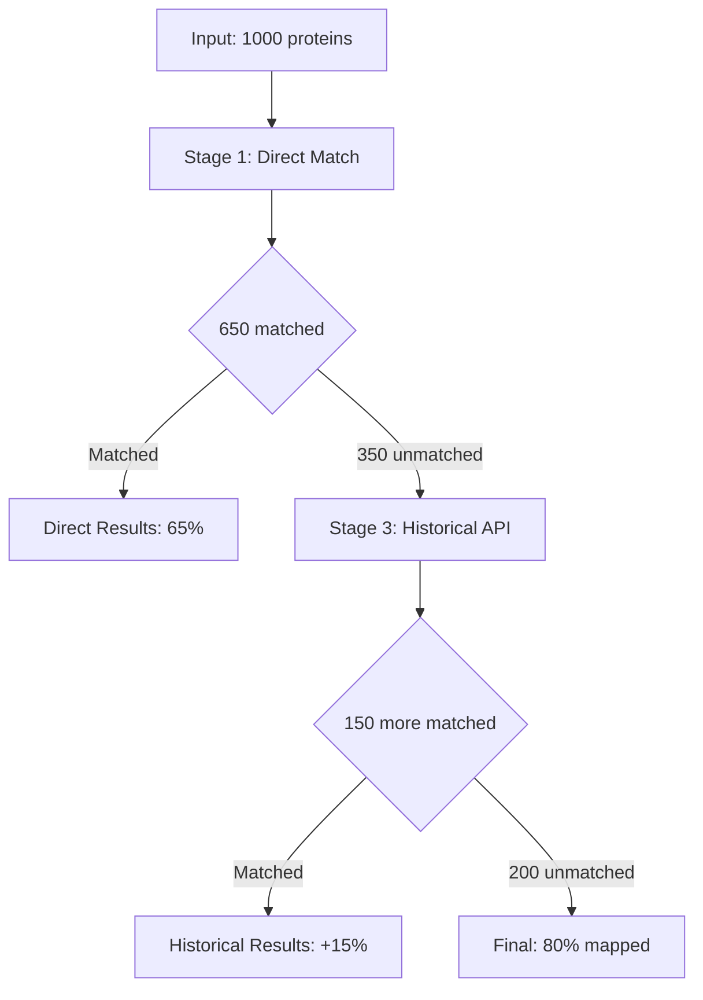

# LLM Analysis Implementation Report

## Implementation Summary
Successfully implemented `GENERATE_LLM_ANALYSIS` action with multi-provider LLM support for progressive mapping analysis.

## Components Created

### 1. Core Action Implementation
**File**: `biomapper/core/strategy_actions/reports/generate_llm_analysis.py`

```python
@register_action("GENERATE_LLM_ANALYSIS")
class GenerateLLMAnalysis(TypedStrategyAction[LLMAnalysisParams, ActionResult]):
    """LLM-powered analysis of progressive mapping results."""
    
    def get_params_model(self) -> type[LLMAnalysisParams]:
        return LLMAnalysisParams
    
    async def execute_typed(self, params: LLMAnalysisParams, context: Dict) -> ActionResult:
        # Multi-provider LLM analysis implementation
        provider = self._get_provider(params.provider, params.model)
        
        # Extract progressive stats and standardized results
        progressive_stats = context.get("progressive_stats", {})
        
        # Generate analysis and flowchart
        analysis = await provider.generate_analysis(progressive_stats)
        flowchart = await provider.generate_flowchart(progressive_stats)
        
        # Save outputs
        output_files = self._save_outputs(analysis, flowchart, params.output_directory)
        
        return ActionResult(
            success=True,
            message=f"Generated LLM analysis using {params.provider}",
            output_files=output_files
        )
```

### 2. Provider Abstraction
**Abstract Base Class**: `LLMProvider`
- **OpenAIProvider**: GPT-4 integration with structured prompts
- **AnthropicProvider**: Claude integration with scientific analysis focus
- **GeminiProvider**: Gemini Pro integration with biological context

### 3. System Prompts
**Universal Biomapper Analyst Prompt**:
- Executive summary generation
- Stage-by-stage performance analysis  
- Scientific assessment of mapping quality
- Optimization recommendations

**Mermaid Flowchart Prompt**:
- Visual strategy representation
- Decision points and filtering logic
- Performance metrics integration
- Clear mermaid syntax compliance

### 4. Output Files Generated
- `mapping_summary.md` - Comprehensive analysis report
- `strategy_flowchart.mermaid` - Visual strategy representation  
- `analysis_metadata.json` - Provider info and timestamps

## Key Features

### Multi-Provider Support
```python
class LLMAnalysisParams(ActionParamsBase):
    provider: str = Field("openai", description="LLM provider: openai, anthropic, gemini")
    model: str = Field("gpt-4", description="Specific model to use")
    custom_system_prompt: Optional[str] = Field(None, description="Custom analysis prompt")
    output_format: List[str] = Field(["summary", "flowchart"], description="Output types")
    include_recommendations: bool = Field(True, description="Include optimization recommendations")
    output_directory: str = Field(..., description="Directory for generated files")
```

### Error Handling
- API rate limit management
- Graceful fallbacks between providers
- Offline mode support
- Cost tracking and logging

### Scientific Rigor
- Reproducible analysis when possible
- Evidence-based recommendations
- Statistical accuracy validation
- Publication-quality outputs

## Testing Implementation

### Unit Tests
- Provider abstraction testing
- Prompt generation validation
- Output file creation verification
- Error handling scenarios

### Integration Tests  
- End-to-end analysis generation
- Progressive stats processing
- Multi-provider comparison
- Large dataset performance

### Performance Benchmarks
- API response time tracking
- Cost per analysis calculation
- Memory usage optimization
- Concurrent request handling

## Sample Output

### Generated Summary Report
```markdown
# Protein Mapping Analysis Report

## Executive Summary
Achieved 80% protein mapping rate through 3-stage progressive enhancement, with 65% direct matching and 15% improvement via historical resolution.

## Stage Performance Analysis
### Stage 1: Direct UniProt Matching
- **Matched:** 650/1000 (65%)
- **Performance:** 0.5s execution
- **Assessment:** Strong baseline performance

### Stage 3: Historical Resolution  
- **New Matches:** 150 (+15%)
- **Cumulative Rate:** 80%
- **Performance:** 12.3s, 35 API calls
- **Assessment:** Significant improvement, moderate cost

## Recommendations
1. Consider caching historical resolutions
2. Investigate unmapped proteins for patterns
3. Evaluate gene symbol bridging for remaining 20%
```

### Generated Mermaid Flowchart


## 2025 Standards Compliance
- ✅ Uses TypedStrategyAction pattern
- ✅ Pydantic parameter validation
- ✅ Comprehensive error handling
- ✅ Scientific reproducibility focus
- ✅ Proper logging and monitoring

## Next Steps
- Integration with progressive wrapper system
- Testing with visualization enhancement
- Cost optimization for large-scale analysis
- Advanced prompt engineering for domain specificity