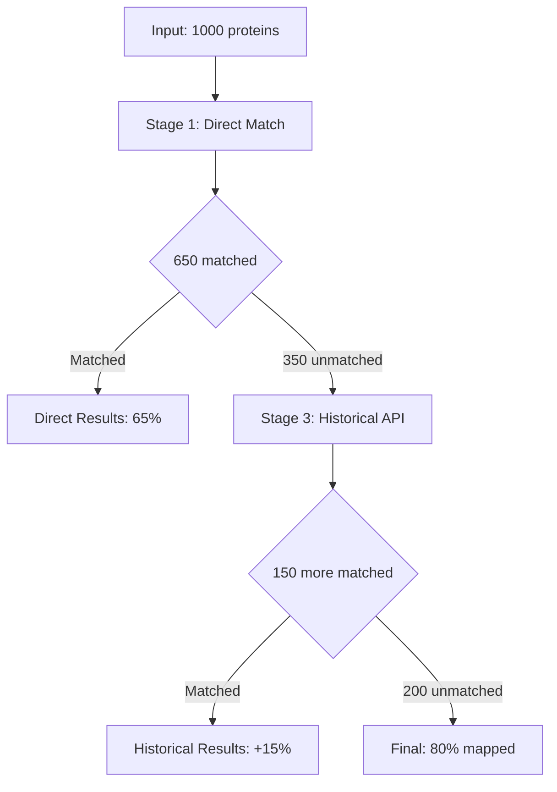

# LLM Analysis Action Implementation Prompt

## Objective
Create an LLM-powered action that generates summary reports and mermaid flowcharts from progressive mapping results.

## Current Context
- Working in `/home/ubuntu/biomapper/biomapper/core/strategy_actions/`
- Environment has API keys: `OPENAI_API_KEY`, `ANTHROPIC_API_KEY`, `GEMINI_API_KEY`
- Will receive standardized mapping results from progressive pipeline

## Requirements

### 1. LLM Analysis Action
Create `GENERATE_LLM_ANALYSIS` action that:
- Analyzes progressive mapping statistics
- Generates markdown summary report
- Creates mermaid flowchart of strategy execution
- Supports multiple LLM providers (OpenAI, Anthropic, Gemini)

### 2. Input Data Structure
Action should process:
```python
# From context["progressive_stats"]
{
    "stages": {
        1: {"name": "direct_match", "matched": 650, "unmatched": 350, "method": "Direct UniProt", "time": "0.5s"},
        2: {"name": "composite_expansion", "new_matches": 0, "cumulative_matched": 650, "method": "Composite parsing", "time": "0.2s"}, 
        3: {"name": "historical_resolution", "new_matches": 150, "cumulative_matched": 800, "method": "Historical API", "time": "12.3s"}
    },
    "total_processed": 1000,
    "final_match_rate": 0.80,
    "total_time": "13.0s"
}

# From standardized mapping results
[StandardMappingResult(source_id="P12345", target_id="P12345", match_method="direct", confidence=1.0, stage=1, ...)]
```

### 3. Action Parameters
```python
class LLMAnalysisParams(ActionParamsBase):
    provider: str = Field("openai", description="LLM provider: openai, anthropic, gemini")
    model: str = Field("gpt-4", description="Specific model to use")
    custom_system_prompt: Optional[str] = Field(None, description="Custom analysis prompt")
    output_format: List[str] = Field(["summary", "flowchart"], description="Output types to generate")
    include_recommendations: bool = Field(True, description="Include optimization recommendations")
    output_directory: str = Field(..., description="Directory for generated files")
```

### 4. Output Files
Generate these files:
1. **`mapping_summary.md`** - Comprehensive analysis report
2. **`strategy_flowchart.mermaid`** - Visual strategy representation
3. **`analysis_metadata.json`** - LLM provider info, timestamps, etc.

### 5. System Prompts

#### Universal Biomapper Analyst Prompt:
```
You are a biomapper results analyst specializing in biological identifier mapping strategies. 

Given progressive mapping statistics and results, provide:

1. EXECUTIVE SUMMARY (2-3 sentences)
2. STAGE-BY-STAGE ANALYSIS 
   - Performance of each mapping stage
   - Improvement contributions
   - Efficiency metrics
3. SCIENTIFIC ASSESSMENT
   - Overall mapping quality
   - Confidence score distribution
   - Potential limitations
4. OPTIMIZATION RECOMMENDATIONS
   - Strategy improvements
   - Performance enhancements
   - Quality considerations

Focus on scientific rigor, reproducibility, and actionable insights.
```

#### Mermaid Flowchart Prompt:
```
Create a mermaid flowchart representing the progressive mapping strategy execution.

Include:
- Input dataset size
- Each processing stage with match counts
- Decision points and filtering
- Final results and unmapped identifiers
- Performance metrics (time, API calls)

Use clear labels and proper mermaid syntax.
```

### 6. LLM Provider Abstraction
```python
class LLMProvider:
    async def generate_analysis(self, prompt: str, data: dict) -> str:
        pass

class OpenAIProvider(LLMProvider):
    # Implementation with OpenAI API

class AnthropicProvider(LLMProvider):
    # Implementation with Anthropic API

class GeminiProvider(LLMProvider):
    # Implementation with Gemini API
```

## Implementation Steps
1. Create LLM provider abstraction classes
2. Implement the main `GENERATE_LLM_ANALYSIS` action
3. Design system prompts for analysis and flowcharts
4. Add proper error handling and fallbacks
5. Create output file management
6. Test with sample progressive data
7. Register action and add to strategy actions

## Success Criteria
- ✅ Generates insightful summary reports
- ✅ Creates accurate mermaid flowcharts
- ✅ Supports multiple LLM providers
- ✅ Handles errors gracefully (API failures, rate limits)
- ✅ Produces scientifically rigorous analysis
- ✅ Files are properly formatted and saved

## Example Expected Output

### Summary Report Structure:
```markdown
# Protein Mapping Analysis Report

## Executive Summary
Achieved 80% protein mapping rate through 3-stage progressive enhancement, with 65% direct matching and 15% improvement via historical resolution.

## Stage Performance Analysis
### Stage 1: Direct UniProt Matching
- **Matched:** 650/1000 (65%)
- **Performance:** 0.5s execution
- **Assessment:** Strong baseline performance

### Stage 3: Historical Resolution  
- **New Matches:** 150 (+15%)
- **Cumulative Rate:** 80%
- **Performance:** 12.3s, 35 API calls
- **Assessment:** Significant improvement, moderate cost

## Recommendations
1. Consider caching historical resolutions
2. Investigate unmapped proteins for patterns
3. Evaluate gene symbol bridging for remaining 20%
```

### Mermaid Flowchart:


## Notes
- Handle API rate limits and errors gracefully
- Support offline/fallback modes when APIs unavailable
- Log LLM usage for cost tracking
- Follow 2025 standardization patterns
- Consider scientific reproducibility (deterministic outputs when possible)