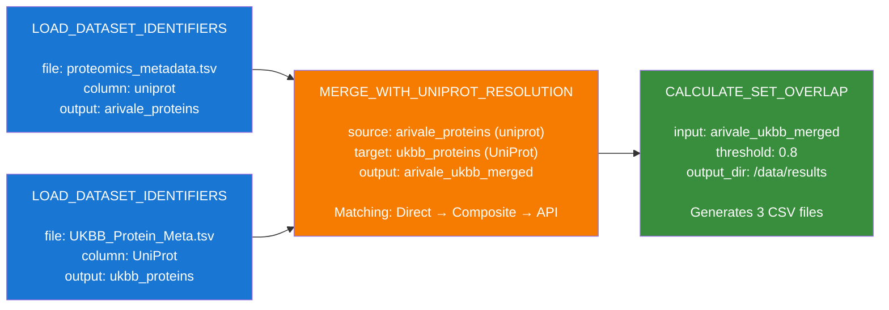

# Arivale to UK Biobank Mapping Workflow

This flowchart shows the step-by-step process defined in `arivale_ukbb_mapping.yaml`, with each action type and its critical parameters.

## Action Types Explained

### 1. LOAD_DATASET_IDENTIFIERS
**Purpose**: Loads a TSV/CSV file containing biological identifiers into memory

**Key Parameters**:
- `file_path`: Path to the data file
- `identifier_column`: Column name containing the identifiers to extract
- `output_key`: Name to store the dataset in the execution context

**Output**: Creates a dataset in the context containing all rows from the file

### 2. MERGE_WITH_UNIPROT_RESOLUTION
**Purpose**: Intelligently merges two protein datasets using multiple matching strategies

**Key Parameters**:
- `source_dataset_key`: Name of the first dataset (from context)
- `source_id_column`: Column with identifiers in source dataset
- `target_dataset_key`: Name of the second dataset (from context)
- `target_id_column`: Column with identifiers in target dataset
- `output_key`: Name for the merged dataset

**Matching Strategies**:
1. **Direct matching**: Exact string comparison
2. **Composite resolution**: Handles IDs like "Q14213_Q8NEV9"
3. **Historical/API lookup**: Resolves obsolete or changed identifiers

**Output**: Merged dataset preserving ALL rows with match metadata

### 3. CALCULATE_SET_OVERLAP
**Purpose**: Analyzes the merge results and generates statistics

**Key Parameters**:
- `input_key`: Name of the merged dataset to analyze
- `confidence_threshold`: Minimum confidence to consider a match (0.8 = 80%)
- `source_name`/`target_name`: Labels for the datasets
- `output_dir`: Where to save the result files

**Output Files**:
1. `overlap_statistics.csv`: Summary statistics (total counts, match rates)
2. `match_type_breakdown.csv`: Counts by match type (direct, composite, historical)
3. `merged_dataset.csv`: The full merged dataset with all metadata

## Data Flow Summary

1. **Two TSV files** are loaded into memory as separate datasets
2. **Merge process** attempts to match proteins between datasets using three strategies
3. **All rows preserved**: Both matched and unmatched records are kept
4. **Analysis step** calculates statistics and exports results to CSV files

The workflow is designed to handle the complexity of biological data where:
- Identifiers may not match exactly
- Proteins may have multiple IDs (composite)
- IDs may have changed over time (historical)