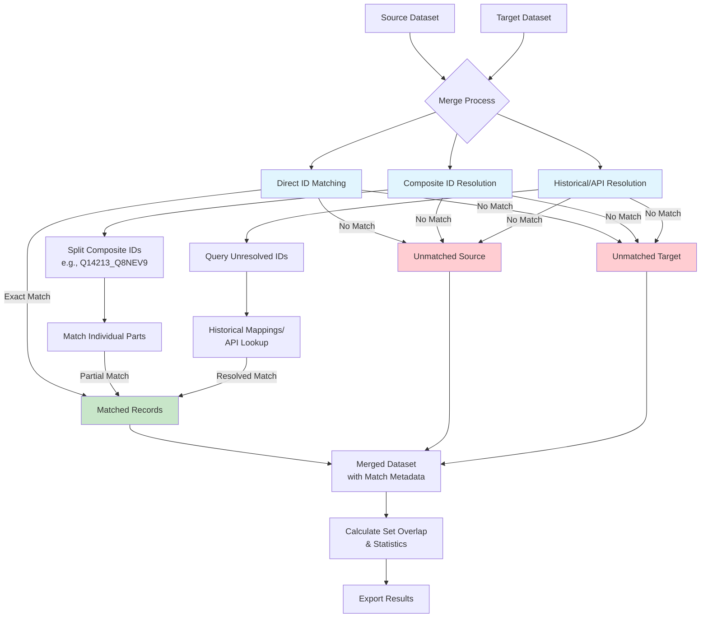

# Biomapper Workflow - Generic Data Merging Process

This diagram illustrates the generic workflow for merging biological datasets in Biomapper, showing the detailed matching phases used in configurations like `arivale_ukbb_mapping.yaml`.

## Workflow Phases

### Phase 1: Direct ID Matching
- Performs exact string comparison between source and target identifiers
- Most straightforward and highest confidence matches
- Example: `P12345` in source matches `P12345` in target

### Phase 2: Composite ID Resolution
- Handles complex identifiers containing multiple IDs separated by delimiters (typically `_`)
- Splits composite IDs and attempts to match individual components
- Example: Source has `Q14213_Q8NEV9`, target has `Q14213` → Creates a match for `Q14213`
- Supports many-to-many relationships common in biological data

### Phase 3: Historical/API Resolution
- Attempts to resolve remaining unmatched identifiers
- Queries external resources (UniProt API, historical mapping databases)
- Handles cases where identifiers have changed over time
- Example: Obsolete ID `P12345` maps to current ID `P67890`

### Output Dataset
The merged dataset preserves ALL records from both source and target datasets, including:
- **Matched Records**: With match metadata (type, confidence, value)
- **Unmatched Source Records**: Source-only records with null target fields
- **Unmatched Target Records**: Target-only records with null source fields

### Metadata Tracked
Each merged record includes:
- `match_value`: The identifier value that matched
- `match_type`: `direct`, `composite`, or `historical`
- `match_confidence`: Confidence score (0.0 to 1.0)
- `match_status`: `matched`, `source_only`, or `target_only`
- `api_resolved`: Boolean indicating if external API was used

## Configuration Parameters

The merge process is controlled by parameters in the YAML configuration:
- `source_id_column`: Column name containing identifiers in source dataset
- `target_id_column`: Column name containing identifiers in target dataset
- `composite_separator`: Delimiter for composite IDs (default: `_`)
- `use_api`: Whether to use external API for resolution
- `confidence_threshold`: Minimum confidence score to keep matches