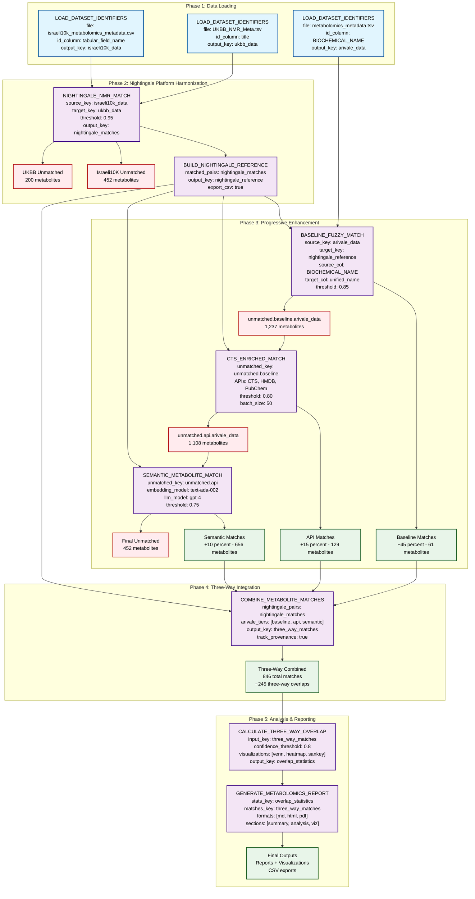

# Three-Way Metabolomics Mapping Strategy Flow

This flowchart visualizes the strategy defined in `/home/ubuntu/biomapper/configs/three_way_metabolomics_mapping_strategy.yaml` for harmonizing metabolomics data across Israeli10K, UKBB, and Arivale cohorts.

## Key Insight
Israeli10K and UKBB both use the Nightingale NMR platform, providing a strong bridge for direct mapping. Arivale uses a different system but has rich identifier metadata (HMDB, KEGG, PubChem).

## Strategy Flow

## Expected Outcomes

### Match Rates by Stage
- **Israeli10K ↔ UKBB**: ~80-90% (same platform)
- **Arivale → Nightingale**:
  - Tier 1 (Direct): ~45%
  - Tier 2 (API): +15% = 60% cumulative
  - Tier 3 (Semantic): +10% = 70% cumulative

### Three-Way Overlap
The final three-way matches represent metabolites that can be tracked across all three cohorts:
- **High Confidence** (>0.9): Direct Nightingale matches + Tier 1 Arivale
- **Medium Confidence** (0.8-0.9): API-enriched matches
- **Lower Confidence** (0.75-0.8): Semantic/LLM matches

### Key Outputs
1. **Nightingale Reference** (`nightingale_reference.csv`): Unified metabolite names for Israeli10K/UKBB
2. **Three-Way Matches** (tracked with provenance): Complete mapping across all cohorts
3. **Visualization Suite**:
   - 3-way Venn diagram showing overlap
   - Confidence heatmap by metabolite category
   - Sankey diagram showing match provenance
4. **Comprehensive Report**: Analysis of coverage, gaps, and recommendations

## Implementation Status

Currently implemented:
- ✅ Data loading (LOAD_DATASET_IDENTIFIERS)
- ✅ Nightingale matching (NIGHTINGALE_NMR_MATCH) 
- ✅ Reference building (BUILD_NIGHTINGALE_REFERENCE)
- ✅ Direct name matching (BASELINE_FUZZY_MATCH)
- ✅ API enrichment (CTS_ENRICHED_MATCH)
- ✅ Vector similarity (VECTOR_ENHANCED_MATCH)

Not yet implemented:
- ❌ METABOLITE_NAME_MATCH (can use BASELINE_FUZZY_MATCH)
- ❌ METABOLITE_API_ENRICHMENT (partial - CTS only)
- ❌ ENRICHED_METABOLITE_MATCH
- ❌ SEMANTIC_METABOLITE_MATCH (partial - vector search only)
- ❌ COMBINE_METABOLITE_MATCHES
- ❌ CALCULATE_THREE_WAY_OVERLAP
- ❌ GENERATE_METABOLOMICS_REPORT (basic version exists)

## Next Steps

To achieve full three-way mapping:
1. Run the existing progressive enhancement pipeline to validate the approach
2. Implement missing action types or adapt existing ones
3. Execute the full three-way strategy
4. Generate comprehensive overlap analysis and visualizations