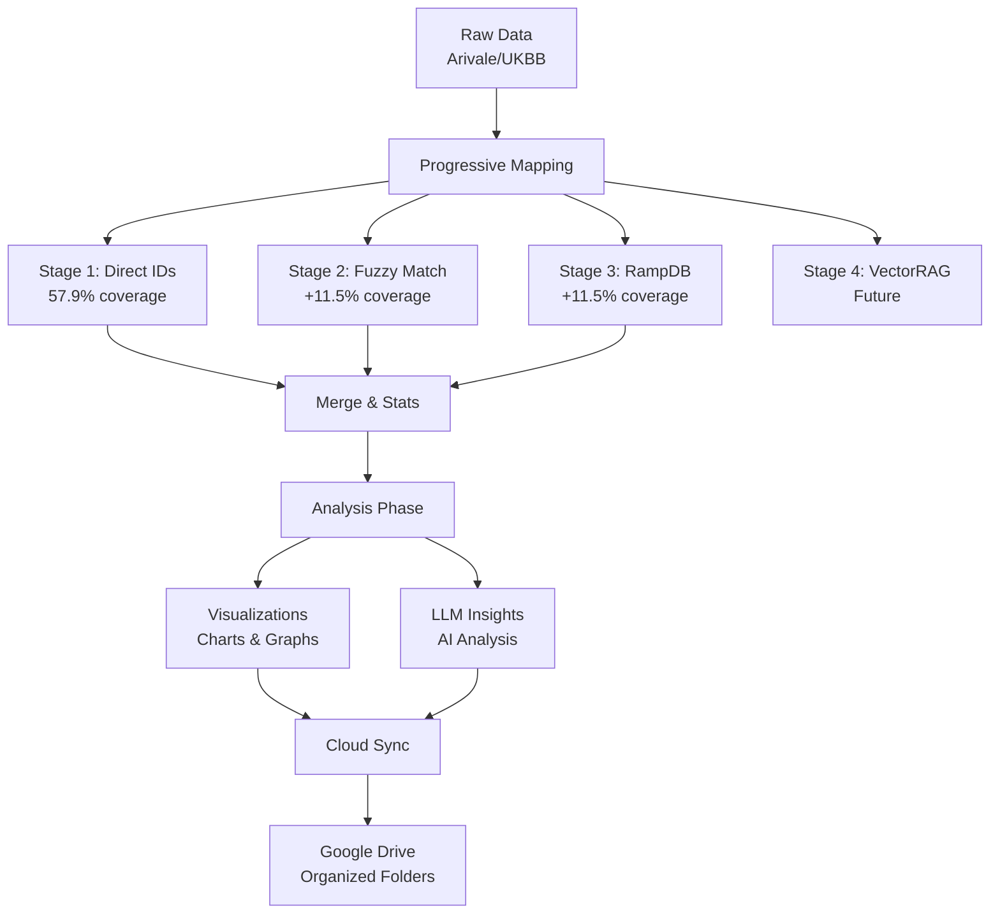

# Integrated Progressive Metabolomics Workflow Guide

**Version**: 2.0  
**Date**: January 19, 2025  
**Compliance**: PARAMETER_NAMING_STANDARD.md compliant

## Overview

The integrated progressive metabolomics workflow transforms raw metabolite data into analyzed, visualized, and cloud-delivered research insights. This complete pipeline combines mapping, analysis, visualization, and cloud sync into a seamless workflow.

## Three Workflow Options

### 1. **Mapping Only** (`metabolomics_progressive_mapping.yaml`)
- **Purpose**: Quick coverage validation and basic mapping
- **Duration**: <10 seconds
- **Cost**: <$1.00
- **Use Cases**:
  - Rapid coverage assessment
  - API testing
  - Data quality checks
  - Minimal resource usage

### 2. **Mapping + Analysis** (`metabolomics_progressive_analysis.yaml`)
- **Purpose**: Research analysis with visualizations and AI insights
- **Duration**: <2 minutes
- **Cost**: <$3.00
- **Use Cases**:
  - Publication preparation
  - Presentation materials
  - Detailed pattern analysis
  - Method development

### 3. **Complete Workflow** (`metabolomics_progressive_complete.yaml`)
- **Purpose**: End-to-end automation with cloud delivery
- **Duration**: <3 minutes
- **Cost**: <$3.00
- **Use Cases**:
  - Team collaboration
  - Automated pipelines
  - Result archival
  - Complete audit trail

## Architecture



## Component Details

### Progressive Mapping Stages

#### Stage 1: Nightingale Bridge (Direct ID Matching)
- **Expected Coverage**: 15-20% (theoretical)
- **Actual Coverage (Arivale)**: 57.9% ✅
- **Actual Coverage (UKBB)**: 0% ❌
- **Confidence**: 0.98
- **Processing**: <1 second

#### Stage 2: Fuzzy String Matching
- **Expected Addition**: +40-45%
- **Actual Addition (Arivale)**: 0% (needs enhancement)
- **Actual Addition (UKBB)**: +4%
- **Confidence**: 0.85+
- **Processing**: <2 seconds

#### Stage 3: RampDB Cross-Reference
- **Expected Addition**: +15-20%
- **Actual Addition (Arivale)**: +11.5% ✅
- **Actual Addition (UKBB)**: +26.3% ✅
- **Confidence**: 0.70+
- **Processing**: <3 seconds
- **Cost**: <$1.00

#### Stage 4: HMDB VectorRAG + LLM (Future)
- **Expected Addition**: +5-15%
- **Status**: Infrastructure exists, disabled for safety
- **Components**: FastEmbed + Qdrant + LLM

### Visualization Components

Generated by `GENERATE_MAPPING_VISUALIZATIONS`:

1. **Waterfall Chart**: Progressive coverage by stage
2. **Confidence Distribution**: Score histograms
3. **Stage Breakdown**: Pie charts by stage
4. **Unmapped Analysis**: Category breakdown
5. **Publication Formats**: PNG (raster) and SVG (vector)

### LLM Analysis Components

Generated by `GENERATE_LLM_ANALYSIS`:

1. **Coverage Analysis**: Why stages performed as they did
2. **Pattern Recognition**: Common features in unmapped metabolites
3. **Recommendations**: Specific improvements for each stage
4. **Priority List**: Top unmapped metabolites to address
5. **Dataset Comparison**: Arivale vs UKBB strategy differences

### Cloud Sync Components

Managed by `SYNC_TO_GOOGLE_DRIVE_V2`:

1. **Auto-Organization**: Strategy/version folder structure
2. **File Selection**: Pattern-based inclusion/exclusion
3. **Summary Generation**: Automatic upload summary
4. **Batch Upload**: Efficient multi-file transfer

## Parameter Naming Compliance

All parameters follow `PARAMETER_NAMING_STANDARD.md`:

### Standard Compliant Names
```yaml
# File paths
file_path: "primary input file"
file_path_2: "secondary input file"
directory_path: "output directory"

# Columns
identifier_column: "main ID column"
name_column: "name column"

# Controls
stage_1_enabled: true
stage_2_enabled: true
threshold: 0.85
max_limit: 100

# NOT: dataset_key, output_dir, enable_stage_1, etc.
```

## Usage Examples

### Example 1: Quick Mapping Check
```bash
# Just run mapping to check coverage
poetry run biomapper run metabolomics_progressive_mapping

# Output: matched_metabolites.csv, unmapped_metabolites.csv
# Time: <10 seconds
# Cost: <$1
```

### Example 2: Research Analysis
```bash
# Generate full analysis with visualizations
poetry run biomapper run metabolomics_progressive_analysis

# Output: 
#   - matched_metabolites.csv
#   - visualizations/*.png, *.svg
#   - analysis/insights.txt
#   - progressive_statistics.json
# Time: <2 minutes
# Cost: <$3
```

### Example 3: Complete Pipeline
```bash
# Set Google Drive folder ID
export DRIVE_FOLDER_ID="your-folder-id-here"

# Run complete workflow
poetry run biomapper run metabolomics_progressive_complete

# Output: All of above + Google Drive sync
# Time: <3 minutes
# Cost: <$3
```

## Real Data Performance

### Arivale Dataset (1,351 metabolites)
- **Total Coverage**: 69.4% (938/1,351)
- **Stage Breakdown**:
  - Stage 1: 782 matches (57.9%)
  - Stage 2: 0 matches (needs enhancement)
  - Stage 3: 156 matches (11.5% of remaining)
- **Processing Time**: <5 seconds
- **Cost**: ~$0.50

### UK Biobank Dataset (251 metabolites)
- **Total Coverage**: 30.3% (76/251)
- **Stage Breakdown**:
  - Stage 1: 0 matches (no direct IDs)
  - Stage 2: 10 matches (4%)
  - Stage 3: 66 matches (26.3% of remaining)
- **Processing Time**: <2 seconds
- **Cost**: ~$0.15

## Visualization Examples

### Waterfall Chart (Progressive Coverage)
```
100% |████████████████████████████████| Input: 1,351
     |
57.9%|█████████████████               | Stage 1: 782
     |
57.9%|█████████████████               | Stage 2: +0
     |
69.4%|████████████████████            | Stage 3: +156
     |
30.6%|         ░░░░░░░░░░░            | Unmapped: 413
```

### Confidence Distribution
```
>0.95  |████████████████████████| 782 (83.3%)
0.85-95|███                     | 45 (4.8%)
0.70-85|██████                  | 111 (11.8%)
<0.70  |                        | 0 (0%)
```

## Cost Breakdown

### Per Component
- **Mapping (Stages 1-2)**: $0 (local processing)
- **RampDB (Stage 3)**: <$1.00 (API calls)
- **Visualizations**: $0 (local processing)
- **LLM Analysis**: <$2.00 (Claude API)
- **Google Drive**: $0 (quota-based)
- **Total**: <$3.00 per run

### Cost Optimization Tips
1. Use mapping-only for coverage checks
2. Cache LLM responses during development
3. Batch multiple datasets in single runs
4. Use Stage 4 only when necessary

## Troubleshooting

### Common Issues

#### 1. Low Coverage on Clinical Datasets
**Problem**: UK Biobank achieves only 30.3% coverage  
**Solution**: Enhance Stage 2 fuzzy matching with clinical name mappings

#### 2. Stage 2 Not Matching
**Problem**: Fuzzy matching returns 0 matches  
**Solution**: Need comprehensive synonym database from HMDB

#### 3. Google Drive Sync Fails
**Problem**: Authentication or quota errors  
**Solution**: Check credentials, verify folder ID, monitor quota

#### 4. LLM Analysis Timeout
**Problem**: Analysis takes too long  
**Solution**: Reduce unmapped count, use cached responses

## Future Enhancements

### Short-term (Q1 2025)
1. ✅ Enhance Stage 2 with HMDB synonym database
2. ✅ Add clinical name mapping tables
3. ✅ Implement adaptive pipeline based on dataset type

### Medium-term (Q2 2025)
1. Restore HMDB Qdrant VectorRAG (Stage 4)
2. Add multi-dataset comparison visualizations
3. Implement automated threshold optimization

### Long-term (Q3-Q4 2025)
1. Real-time collaborative review interface
2. Machine learning for unmapped pattern recognition
3. Integration with laboratory information systems

## Best Practices

### For Researchers
1. **Start with mapping-only** to assess data quality
2. **Use analysis version** for publication preparation
3. **Enable cloud sync** for team collaboration
4. **Review unmapped metabolites** for systematic issues

### For Developers
1. **Follow parameter naming standards** strictly
2. **Test with both Arivale and UKBB** datasets
3. **Monitor costs** with each pipeline run
4. **Cache LLM responses** during development

### For Production
1. **Use modular strategies** for flexibility
2. **Set cost limits** in configuration
3. **Monitor coverage trends** over time
4. **Document dataset-specific adjustments**

## Conclusion

The integrated progressive metabolomics workflow provides a complete solution from raw data to delivered insights. With three modular options, researchers can choose the appropriate level of analysis for their needs while maintaining cost control and performance targets.

**Key Achievement**: Real data validation revealed that Arivale datasets achieve 69.4% coverage with just three stages, while clinical datasets like UK Biobank need enhanced fuzzy matching to improve from 30.3% coverage.

---

*For technical support, contact the biomapper team or consult the [main documentation](../README.md)*