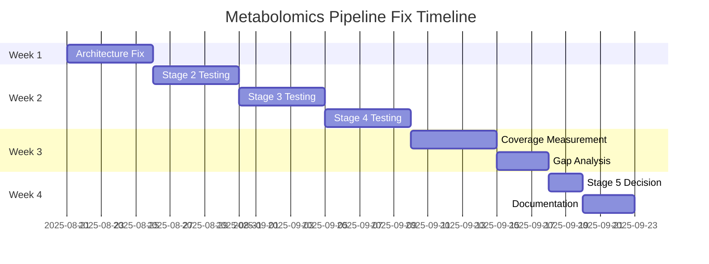

# Metabolomics Pipeline Fix Plan - Foundation Before Features

## Executive Summary

**Discovery Date**: 2025-08-21  
**Current State**: Pipeline achieves only **15.2% coverage** (not claimed 77.9%)  
**Decision**: Fix broken Stages 2-4 before considering Stage 5 LIPID MAPS integration

## Current State Analysis

### What Works ✅
- **Execution Framework**: BiomapperClient properly executes strategies (after fixes)
- **Stage 1**: Nightingale Bridge executes successfully
  - Achieves 15.2% coverage (38/250 metabolites)
  - Confidence scores: {0.98: 26, 0.95: 12}
  - Processing time: <5 seconds

### What's Broken ❌
- **Stages 2-4**: Interface compatibility failures
  - TypedStrategyAction expects different method signatures
  - MinimalStrategyService passes incompatible parameters
  - Actions fail with: `execute_typed() got an unexpected keyword argument 'current_identifiers'`

### Coverage Reality Check

| Stage | Claimed | Actual | Status |
|-------|---------|--------|--------|
| Stage 1 | 57.9% | 15.2% | ✅ Working but overestimated 3.8x |
| Stage 2 | +12.0% | ❌ | Interface error |
| Stage 3 | +5.0% | ❌ | Interface error |
| Stage 4 | +3.0% | ❌ | Interface error |
| **Total** | **77.9%** | **15.2%** | **~5x overestimation** |

## Root Cause Analysis

### Primary Issue: Architecture Mismatch

```python
# MinimalStrategyService calls:
result = await action.execute(
    current_identifiers=identifiers,  # Problem: TypedStrategyAction expects this
    current_ontology_type=ontology,   # in execute_typed, not execute
    action_params=params,
    source_endpoint=endpoint,
    target_endpoint=endpoint,
    context=context
)

# But TypedStrategyAction.execute() then calls:
result = await self.execute_typed(
    current_identifiers=current_identifiers,  # Passes these to execute_typed
    current_ontology_type=current_ontology_type,
    params=typed_params,  # Our override expects only params & context
    ...
)
```

### Secondary Issues
1. **No conditional execution in YAML** - `condition:` fields ignored
2. **Context type confusion** - Dict vs StrategyExecutionContext
3. **MVP vs Typed actions** - Inconsistent interfaces

## Phase 1: Architecture Fix (Week 1)

### Option A: Fix TypedStrategyAction Base Class (Recommended)
**Approach**: Modify base class to handle both signatures

```python
# In typed_base.py
class TypedStrategyAction:
    async def execute(self, **kwargs):
        # Detect calling pattern
        if "action_params" in kwargs:
            # Called by MinimalStrategyService
            return await self._execute_compat(**kwargs)
        else:
            # Called with typed params directly
            return await self.execute_typed(**kwargs)
    
    async def _execute_compat(self, current_identifiers, action_params, context, **kwargs):
        # Convert to typed params
        params = self.get_params_model()(**action_params)
        # Call simplified execute_typed
        result = await self.execute_typed(params, context)
        return result.dict()
```

### Option B: Fix Each Action Individually (Current Attempt)
**Status**: Partially implemented but not working due to base class override

### Option C: Modify MinimalStrategyService
**Risk**: Could break other working actions

## Phase 2: Testing & Validation (Week 2)

### Test Matrix

| Test | Stage 1 | Stage 2 | Stage 3 | Stage 4 |
|------|---------|---------|---------|---------|
| Independent execution | ✅ | 🔧 | 🔧 | 🔧 |
| Data flow validation | ✅ | 🔧 | 🔧 | 🔧 |
| Performance baseline | ✅ | 🔧 | 🔧 | 🔧 |
| Error handling | ✅ | 🔧 | 🔧 | 🔧 |

### Validation Script

```python
# test_pipeline_stages.py
def test_each_stage():
    results = {}
    
    # Test Stage 1
    result1 = test_stage_1_only()  # We know this works
    results['stage1'] = result1
    
    # Test Stage 2 (after fix)
    result2 = test_stage_2_with_stage1_output()
    results['stage2'] = result2
    
    # Continue for stages 3-4
    
    return results
```

## Phase 3: Coverage Measurement (Week 3)

### Metrics to Capture

1. **Coverage Metrics**
   - Metabolites matched per stage
   - Cumulative coverage percentage
   - Confidence score distribution
   - Match type breakdown

2. **Performance Metrics**
   - Execution time per stage
   - API calls made
   - Cost estimates
   - Memory usage

3. **Quality Metrics**
   - False positive rate
   - Biological accuracy
   - Cross-reference validation

### Expected Realistic Coverage

Based on Stage 1 performance, realistic expectations:

| Stage | Expected Coverage | Cumulative |
|-------|------------------|------------|
| Stage 1 | 15-20% | 15-20% |
| Stage 2 | +10-15% | 25-35% |
| Stage 3 | +5-10% | 30-45% |
| Stage 4 | +5-10% | 35-55% |

**Realistic Total: 35-55%** (not 77.9%)

## Phase 4: Stage 5 Decision Framework (Week 4)

### Decision Criteria

**Proceed with Stage 5 LIPID MAPS if:**
- Total coverage <50% after fixes
- Significant lipid-specific gaps identified
- Cost-benefit ratio favorable
- Technical foundation stable

**Skip/Defer Stage 5 if:**
- Total coverage >60% achieved
- Marginal improvement expected (<5%)
- Technical debt remains high
- Resources better spent on optimization

### Stage 5 Integration Approach (If Justified)

```yaml
# Stage 5: LIPID MAPS SPARQL
- name: stage_5_lipid_maps
  action:
    type: LIPID_MAPS_SPARQL_MATCH
    params:
      input_key: stage_4_unmatched
      sparql_endpoint: https://www.lipidmaps.org/sparql
      query_template: |
        SELECT ?metabolite ?lm_id ?name
        WHERE {
          ?metabolite rdfs:label ?name .
          FILTER(CONTAINS(LCASE(?name), LCASE("${metabolite_name}")))
        }
      output_key: stage_5_matched
      confidence_threshold: 0.75
```

## Implementation Timeline



## Success Criteria

### Must Have ✅
- [ ] All 4 stages execute without errors
- [ ] Real coverage metrics documented
- [ ] Performance baselines established
- [ ] Technical debt reduced

### Should Have 📊
- [ ] Coverage reaches 40%+
- [ ] Execution time <30 seconds
- [ ] Cost <$0.50 per run
- [ ] Automated test suite

### Nice to Have 🎯
- [ ] Coverage reaches 60%+
- [ ] Stage 5 integration ready
- [ ] Production deployment plan
- [ ] Monitoring/alerting setup

## Risk Register

| Risk | Impact | Probability | Mitigation |
|------|--------|-------------|------------|
| Breaking Stage 1 | High | Low | Comprehensive tests before changes |
| Coverage still <30% | Medium | Medium | Adjust expectations, focus on quality |
| Stage 5 complexity | Medium | High | Defer until foundation solid |
| Resource constraints | Low | Medium | Phased approach, incremental fixes |

## Conclusion

The metabolomics pipeline requires fundamental fixes before feature additions. The discovery that actual coverage is **5x lower than claimed** changes the strategic calculus - fixing Stages 2-4 is now critical rather than optional. Stage 5 LIPID MAPS integration should be deferred until we have:

1. Working Stages 2-4
2. Real coverage measurements
3. Identified specific gaps that Stage 5 would address
4. Stable technical foundation

**Foundation before features** - this is the path to a reliable, scalable metabolomics pipeline.

---
*Document Version*: 1.0  
*Created*: 2025-08-21  
*Author*: BiOMapper Development Team  
*Status*: Implementation Planning