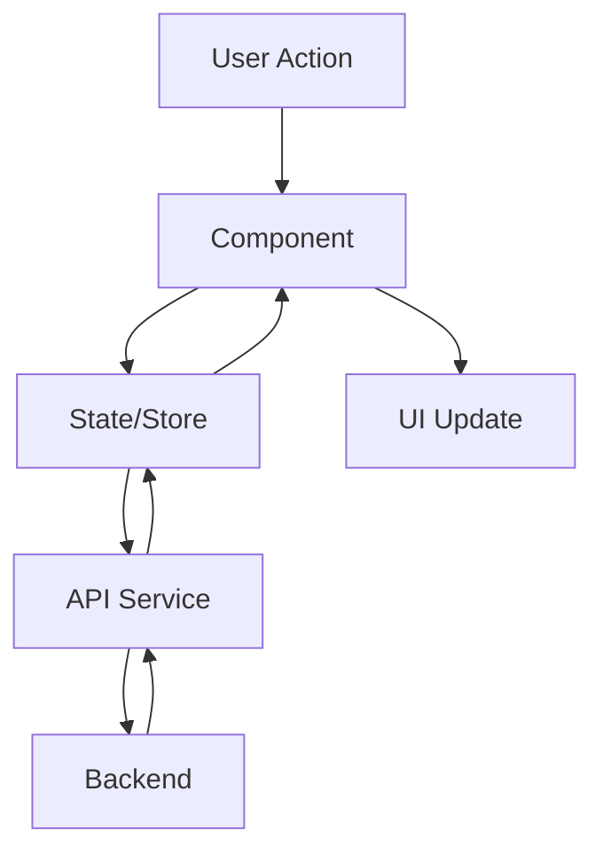

# UI Architecture

This document outlines the architecture of the Biomapper UI.

## Overview

The Biomapper UI is built using React with TypeScript, and uses Vite as the build tool. The application follows a component-based architecture with centralized state management.

## Technology Stack

- **React**: UI framework
- **TypeScript**: Static typing
- **Vite**: Build tool
- **CSS Modules**: Styling
- **React Router**: Routing

## Directory Structure

```
biomapper-ui/
├── public/           # Static assets
├── src/
│   ├── components/   # React components
│   ├── services/     # API services
│   ├── hooks/        # Custom hooks
│   ├── utils/        # Utility functions
│   ├── types/        # TypeScript types
│   ├── App.tsx       # Main application component
│   └── main.tsx      # Entry point
└── package.json      # Dependencies and scripts
```

## Data Flow

The application follows a unidirectional data flow:


