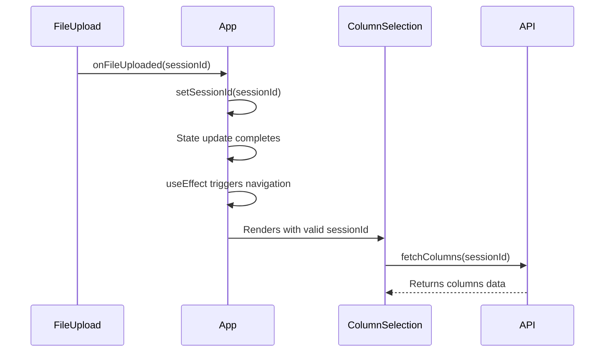
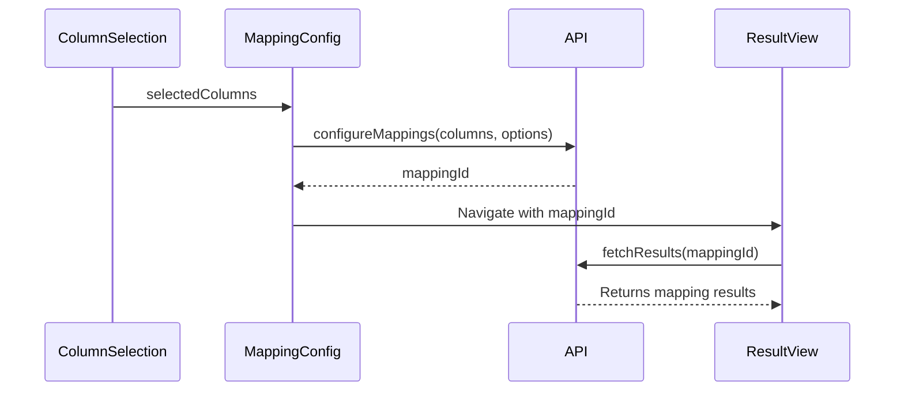
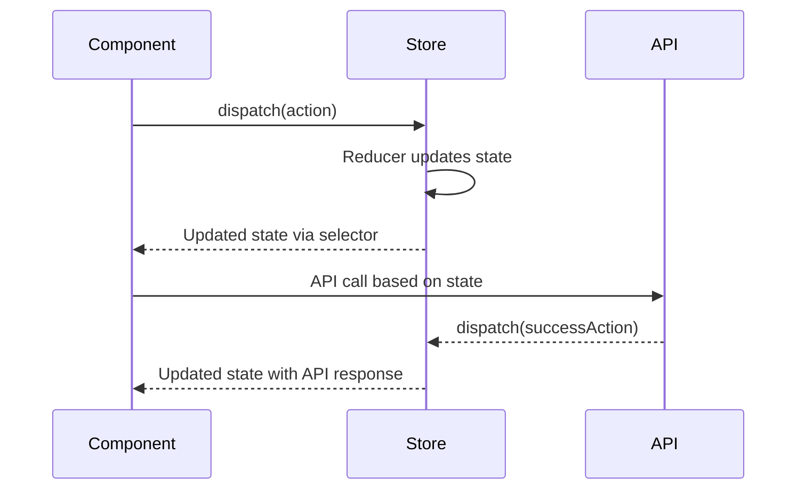

# UI Workflows

This document describes the key workflows in the Biomapper UI using sequence diagrams.

## File Upload Workflow

The following diagram illustrates the workflow when a user uploads a file:

## Mapping Configuration Workflow

The following diagram shows the data flow during the mapping configuration process:

## State Management

The following diagram demonstrates the state management flow in the UI:

