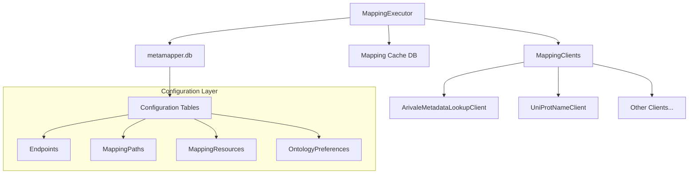
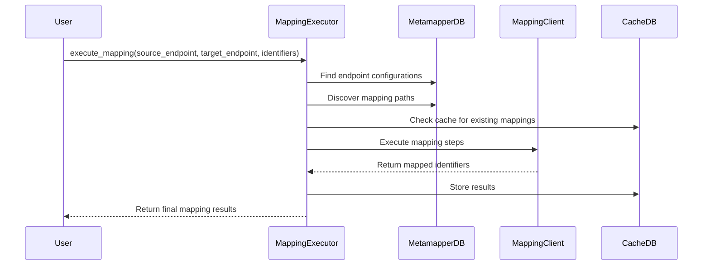
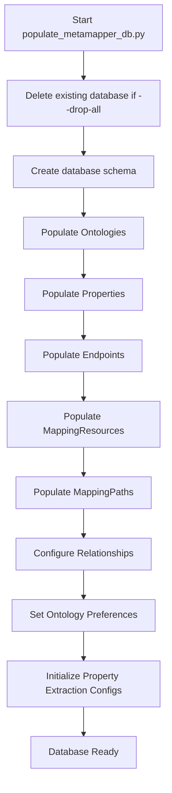

# Biomapper Mapping Workflow Analysis

## Executive Summary

This document provides a comprehensive analysis of the Biomapper project's current end-to-end mapping workflow, including its architecture, configuration system, and extensibility mechanisms. The analysis identifies key strengths of the system's flexible, database-driven approach while highlighting critical areas for improvement in configuration management, error handling, and debugging capabilities.

## Table of Contents

1. [Architecture Overview](#architecture-overview)
2. [End-to-End Mapping Process](#end-to-end-mapping-process)
3. [Database Schema and Configuration](#database-schema-and-configuration)
4. [System Initialization](#system-initialization)
5. [Error Handling and Logging](#error-handling-and-logging)
6. [Critical Analysis and Improvement Suggestions](#critical-analysis-and-improvement-suggestions)
7. [Extensibility Assessment](#extensibility-assessment)
8. [Recommendations](#recommendations)

## Architecture Overview

Biomapper implements a sophisticated, database-driven mapping architecture that separates configuration from execution logic. The system is designed around two core concepts:

### Core Components



### Key Architectural Principles

1. **Configuration-Driven Execution**: All mapping capabilities are defined in `metamapper.db`, allowing runtime discovery of mapping paths without code changes.

2. **Modular Client Architecture**: Individual mapping clients implement the `BaseMappingClient` interface, encapsulating specific data source interactions.

3. **Iterative Path Discovery**: The `MappingExecutor` dynamically discovers and executes multi-step mapping paths based on database configuration.

4. **Extensible Ontology System**: Support for both horizontal (new datasets for existing entity types) and vertical (entirely new entity types) extensibility.

## End-to-End Mapping Process

### High-Level Workflow



### Core Process Flow

1. **Endpoint Resolution**: The executor resolves source and target endpoints from `metamapper.db`, extracting their primary identifier types and properties.

2. **Path Discovery**: Using the ontology preferences and relationship mappings, the executor discovers available paths between source and target ontology types.

3. **Path Prioritization**: Paths are ranked by priority, with direct paths typically preferred over multi-hop paths.

4. **Cache Lookup**: Before executing mapping, the system checks the cache database for existing mappings.

5. **Client Instantiation**: For each path step, the executor instantiates the appropriate mapping client with its configuration.

6. **Iterative Execution**: The executor executes mapping steps sequentially, potentially trying multiple paths if earlier attempts fail.

7. **Result Aggregation**: Results from different paths are merged, with preference given to higher-priority paths.

8. **Cache Storage**: Successful mappings are stored in the cache with metadata about the execution path.

### MappingExecutor Core Logic

The `MappingExecutor` class (located in `/home/ubuntu/biomapper/biomapper/core/mapping_executor.py`) serves as the orchestration engine. Key features include:

- **Asynchronous Operations**: All database operations and client calls are asynchronous for better performance.
- **Connection Pooling**: Uses SQLAlchemy's async engine with connection pooling for both metamapper and cache databases.
- **Path Caching**: In-memory caching of discovered paths to reduce database queries.
- **Composite Identifier Handling**: Specialized logic for handling complex, multi-component identifiers.

### Client Architecture

Mapping clients follow a standardized interface defined in `BaseMappingClient`:

```python
async def map_identifiers(
    self, identifiers: List[str], config: Optional[Dict[str, Any]] = None
) -> Dict[str, Any]
```

#### Example: ArivaleMetadataLookupClient

The `ArivaleMetadataLookupClient` demonstrates the client pattern:

1. **Initialization**: Loads TSV metadata file into memory dictionaries
2. **Caching**: Implements LRU caching for repeated lookups
3. **Composite Handling**: Processes comma-separated UniProt IDs
4. **Error Handling**: Graceful handling of missing files or malformed data

## Database Schema and Configuration

### metamapper.db Schema

The metamapper database serves as the central configuration repository with the following key tables:

#### Core Configuration Tables

1. **Ontologies**: Defines standardized identifier types
   ```sql
   CREATE TABLE ontologies (
       id INTEGER PRIMARY KEY,
       name TEXT UNIQUE NOT NULL,  -- e.g., "UNIPROTKB_AC_ONTOLOGY"
       description TEXT,
       identifier_prefix TEXT,
       namespace_uri TEXT
   );
   ```

2. **Properties**: Links specific property names to ontologies
   ```sql
   CREATE TABLE properties (
       id INTEGER PRIMARY KEY,
       name TEXT NOT NULL,  -- e.g., "UNIPROTKB_AC"
       ontology_id INTEGER REFERENCES ontologies(id),
       is_primary BOOLEAN DEFAULT FALSE
   );
   ```

3. **Endpoints**: Represents data sources or targets
   ```sql
   CREATE TABLE endpoints (
       id INTEGER PRIMARY KEY,
       name TEXT UNIQUE NOT NULL,
       description TEXT,
       type TEXT,
       connection_details TEXT,  -- JSON configuration
       primary_property_name TEXT
   );
   ```

4. **MappingResources**: Defines available mapping tools/clients
   ```sql
   CREATE TABLE mapping_resources (
       id INTEGER PRIMARY KEY,
       name TEXT UNIQUE NOT NULL,
       client_class_path TEXT,
       input_ontology_term TEXT,
       output_ontology_term TEXT,
       config_template TEXT  -- JSON configuration
   );
   ```

5. **MappingPaths**: Sequences of resources for ontology translation
   ```sql
   CREATE TABLE mapping_paths (
       id INTEGER PRIMARY KEY,
       source_type TEXT NOT NULL,
       target_type TEXT NOT NULL,
       name TEXT UNIQUE NOT NULL,
       priority INTEGER DEFAULT 0
   );
   ```

#### Relationship and Configuration Tables

- **EndpointRelationships**: Defines relationships between endpoints
- **OntologyPreferences**: Specifies preferred ontologies for endpoints
- **PropertyExtractionConfigs**: Configures how to extract data from sources
- **EndpointPropertyConfigs**: Links endpoints to their property configurations

### Database Design Strengths

1. **Flexible Configuration**: All mapping capabilities defined in database tables
2. **Runtime Discovery**: New mappings available without code deployment
3. **Hierarchical Preferences**: Support for fallback ontology types
4. **Rich Metadata**: Detailed tracking of mapping provenance and performance

### Database Design Concerns

1. **Complex Schema**: High learning curve for new developers
2. **Configuration Validation**: Limited validation of configurations at insertion time
3. **Path Consistency**: No built-in validation that mapping paths are logically consistent

## System Initialization

### populate_metamapper_db.py

The system initialization is handled by `/home/ubuntu/biomapper/scripts/populate_metamapper_db.py`, which:

1. **Schema Creation**: Creates all necessary tables using SQLAlchemy metadata
2. **Data Population**: Inserts standard ontologies, resources, and mapping paths
3. **Configuration Loading**: Sets up file paths and client configurations

#### Critical Configuration Dependencies

Recent debugging revealed critical dependencies on correct file path configurations:

```python
# Example from populate_metamapper_db.py
"arivale_protein": biomapper.db.models.Endpoint(
    name="Arivale_Protein",
    connection_details='{"path": "/procedure/data/local_data/ARIVALE_SNAPSHOTS/proteomics_metadata.tsv"}',
    primary_property_name="ARIVALE_PROTEIN_ID"
),
```

**Issue Identified**: Hard-coded absolute paths in configuration make the system fragile across different deployment environments.

### Initialization Process Flow



## Error Handling and Logging

### Current Error Handling Mechanisms

1. **Hierarchical Exceptions**: Custom exception hierarchy in `biomapper.core.exceptions`
   - `BiomapperError` (base)
   - `ClientError`, `ConfigurationError`, `CacheError` (specific types)

2. **Client-Level Error Handling**: Each client implements error handling for its specific data source interactions

3. **Path Execution Logging**: Detailed logging of path execution success/failure in cache database

### Logging Architecture

- **Structured Logging**: Uses Python's logging module with configurable levels
- **Performance Metrics**: Optional Langfuse integration for detailed performance tracking
- **Cache Database Logging**: Stores execution logs in `PathExecutionLog` table

### Error Handling Concerns

1. **Configuration Errors**: Silent failures when file paths are incorrect
2. **Limited Validation**: Minimal upfront validation of configurations
3. **Error Recovery**: Limited automatic recovery mechanisms for transient failures

## Critical Analysis and Improvement Suggestions

### Configuration Management Issues

#### Problem: Hard-coded File Paths
**Current State**: File paths are hard-coded in `populate_metamapper_db.py`
```python
"file_path": "/procedure/data/local_data/ARIVALE_SNAPSHOTS/proteomics_metadata.tsv"
```

**Recommended Solution**:
1. **Environment Variable Support**: Use environment variables for base data directories
   ```python
   base_data_dir = os.environ.get('BIOMAPPER_DATA_DIR', '/procedure/data/local_data')
   file_path = f"{base_data_dir}/ARIVALE_SNAPSHOTS/proteomics_metadata.tsv"
   ```

2. **Configuration Validation**: Add startup validation to check file existence
   ```python
   def validate_file_paths(self):
       for endpoint in self.endpoints:
           if 'file_path' in endpoint.connection_details:
               path = endpoint.connection_details['file_path']
               if not Path(path).exists():
                   raise ConfigurationError(f"File not found: {path}")
   ```

3. **Relative Path Support**: Support both absolute and relative paths with base directory resolution

#### Problem: Complex Schema Navigation
**Current State**: Developers must understand complex relationships between 8+ interconnected tables

**Recommended Solution**:
1. **Configuration Builder API**: Create high-level API for common configuration tasks
2. **Schema Documentation**: Generate ER diagrams and relationship documentation
3. **Validation Tools**: Command-line tools to validate configuration consistency

### Data Validation and Integrity

#### Problem: Limited Runtime Validation
**Current State**: Configurations are trusted without validation until execution

**Recommended Solutions**:
1. **Startup Health Checks**: Validate all file paths and API endpoints during initialization
2. **Configuration Schema**: Use JSON Schema or Pydantic models for configuration validation
3. **Dependency Verification**: Verify that all mapping path dependencies are satisfied

### Error Reporting and Debugging

#### Problem: Insufficient Error Context
**Current State**: Errors often lack sufficient context for debugging

**Recommended Improvements**:
1. **Rich Error Messages**: Include configuration details and suggested fixes in error messages
2. **Debug Mode**: Enhanced logging mode for troubleshooting configuration issues
3. **Configuration Tracing**: Track which configuration entries are used during execution

### Performance and Scalability

#### Problem: Potential Performance Bottlenecks
**Current State**: Sequential path execution, potential for large result sets

**Recommended Optimizations**:
1. **Parallel Path Execution**: Execute independent paths concurrently
2. **Streaming Results**: Support streaming for large result sets
3. **Connection Pooling**: Optimize database connection management

## Extensibility Assessment

### Current Extensibility Strengths

1. **Horizontal Extensibility**: Adding new datasets for existing entity types is well-supported
   - New endpoints can be added through database configuration
   - Existing mapping paths can be reused
   - Client implementations can be shared

2. **Modular Client Architecture**: New data sources can be integrated by implementing `BaseMappingClient`

3. **Dynamic Path Discovery**: New mapping capabilities are automatically available without code changes

### Extensibility Limitations

1. **Client Development Complexity**: Creating new clients requires understanding multiple interfaces and error handling patterns

2. **Configuration Complexity**: Adding new entity types requires coordination across multiple database tables

3. **Limited Configuration Abstraction**: No high-level tools for common configuration tasks

### Extensibility Enhancement Recommendations

#### 1. Configuration Abstraction Layer
Create high-level configuration builders:
```python
class EndpointBuilder:
    def __init__(self, name: str):
        self.name = name
        
    def with_file_source(self, file_path: str, delimiter: str = "\t"):
        # Automatically configure file-based endpoint
        
    def with_api_source(self, base_url: str, auth_config: dict):
        # Automatically configure API-based endpoint
```

#### 2. Client Template System
Provide templates for common client patterns:
- File-based lookup clients
- REST API clients
- Database query clients

#### 3. Configuration Validation Framework
```python
class ConfigurationValidator:
    def validate_endpoint(self, endpoint_config: dict) -> List[ValidationError]:
        # Validate endpoint configuration
        
    def validate_mapping_path(self, path_config: dict) -> List[ValidationError]:
        # Validate mapping path consistency
```

#### 4. Enhanced Development Tools
- Configuration visualization tools
- Mapping path testing utilities
- Performance profiling for new configurations

### Vertical Extensibility (New Entity Types)

**Current Process for Adding New Entity Types**:
1. Define new ontology in `Ontologies` table
2. Create properties in `Properties` table
3. Configure endpoints in `Endpoints` table
4. Implement or configure mapping clients
5. Define mapping paths
6. Set up relationships and preferences

**Recommended Improvements**:
1. **Entity Type Templates**: Pre-configured templates for common biological entity types
2. **Incremental Configuration**: Tools to add entity types incrementally without full database recreation
3. **Configuration Migration**: Tools to migrate configurations between environments

## Recommendations

### Immediate Priority (High Impact, Low Effort)

1. **Environment Variable Support**: Replace hard-coded paths with environment variables
2. **Startup Validation**: Add file existence checks during initialization
3. **Enhanced Error Messages**: Include configuration context in error messages

### Medium-Term Priority (High Impact, Medium Effort)

1. **Configuration Builder API**: Create high-level configuration tools
2. **Comprehensive Documentation**: Generate schema documentation and examples
3. **Development Tooling**: Create configuration validation and testing tools

### Long-Term Priority (High Impact, High Effort)

1. **Configuration Management System**: Full-featured configuration management with versioning
2. **Performance Optimization**: Parallel execution and streaming support
3. **Advanced Monitoring**: Real-time monitoring and alerting for mapping operations

### Technical Debt Reduction

1. **Code Documentation**: Comprehensive docstrings and type hints
2. **Test Coverage**: Increase test coverage for configuration edge cases
3. **Refactoring**: Simplify complex configuration logic where possible

## Conclusion

Biomapper's mapping workflow represents a sophisticated and flexible approach to biological identifier mapping. The database-driven configuration system provides excellent extensibility and runtime flexibility. However, the system would benefit significantly from improved configuration management, validation, and developer tooling.

The critical path forward involves:
1. Addressing immediate configuration management issues
2. Building better abstractions for common tasks
3. Investing in developer experience improvements
4. Maintaining the core architectural strengths while reducing complexity

The foundation is solid, but operational robustness and developer experience need attention to realize the system's full potential.