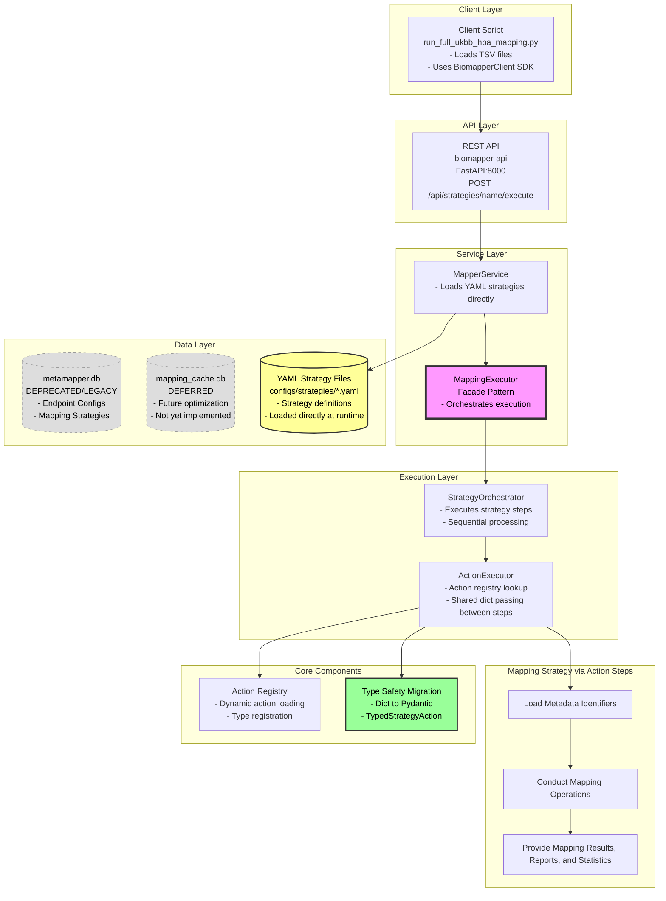

# Biomapper: Technical Architecture Review

## System Overview

Biomapper is a biological data harmonization toolkit that maps identifiers across biological databases. The core workflow follows this architecture:

Example: A researcher runs `run_full_ukbb_hpa_mapping.py` which:
1. Loads UKBB protein assay IDs from a TSV file
2. Uses BiomapperClient SDK to call the API with strategy name "UKBB_HPA_PROTEIN_OVERLAP_ANALYSIS"
3. MapperService loads the YAML strategy directly from `configs/` directory
4. MappingExecutor delegates to StrategyOrchestrator which executes steps sequentially
5. Individual actions execute with parameters defined in the YAML strategy
6. Biological data is loaded directly from CSV/TSV files using hardcoded or strategy-specified paths
7. Returns overlap analysis results (mapping_cache.db caching deferred for future)

## Computer Science Considerations (Amy)

**Architecture Design:**
The system uses a service-oriented architecture where the `MappingExecutor` serves as a facade, delegating to the `StrategyOrchestrator`. Each YAML strategy defines a directed acyclic graph (DAG) of actions that process biological identifiers through various transformations. The system has evolved from database-stored strategies to direct YAML file loading, eliminating the intermediate database step for better development agility.

**Key Algorithmic Components:**
- **Graph-based mapping paths**: Ontology relationships stored as directed graphs; currently using precomputed paths
- **Identifier resolution**: Handles 1:many mappings, historical/obsolete IDs, and composite identifiers
- **Batch processing**: Pipeline design with configurable batch sizes (200-250) to balance memory/API limits
- **Context propagation**: A shared dictionary (`Dict[str, Any]`) passed between action steps, accumulating results and state throughout strategy execution. Each action reads inputs from and writes outputs to this mutable context, enabling data flow through the pipeline

**Considerations for optimization:**
- The sequential execution model in strategies might benefit from identifying parallelizable steps
- Dynamic path-finding could potentially discover better mapping routes than precomputed paths
- The current architecture could support streaming processing for very large datasets

## Software Engineering Considerations (Drew)

**Current Implementation:**
- **FastAPI** service layer with Pydantic validation
- **MappingExecutor** as a facade pattern implementation
- **YAML-driven strategies** loaded directly from `configs/strategies/` directory
- **Async/await** throughout for I/O-bound operations
- **Database evolution**: 
  - metamapper.db: Now only used for endpoint configurations (strategy storage deprecated)
  - mapping_cache.db: Deferred for future caching optimization
- **Action Registry**: Dynamic action loading system with type registration
- **Direct file loading**: Biological data loaded from CSV/TSV files, not databases

**Type Safety Migration:**
The codebase is transitioning from `Dict[str, Any]` to Pydantic models. The new `TypedStrategyAction` base class maintains backward compatibility while introducing type safety. This includes moving from untyped context dictionaries to a typed `StrategyExecutionContext` model, though most actions still use the legacy dictionary approach.

**Architecture Considerations:**
- The facade pattern provides clean separation but adds a layer of indirection
- YAML strategies offer flexibility but lose compile-time validation and IDE support
- The service-oriented design enables scaling but may be overkill for single-machine use
- Direct YAML loading replaced database storage for strategies, improving development velocity
- The deprecated database approach shows the evolution toward simpler, file-based configuration

**Testing Challenges:**
- Integration tests depend on external biological databases
- The 80% coverage requirement is difficult with external dependencies
- Mock strategies might miss real-world edge cases in biological data

## Areas for Feedback

Some aspects that might benefit from your perspectives:

- **Scalability**: The current architecture handles thousands of identifiers well, but millions might require architectural changes
- **Flexibility vs. Simplicity**: The YAML strategy system is powerful but complex - finding the right balance
- **Performance**: Whether to optimize for throughput (batch processing) or latency (streaming)
- **Maintainability**: Managing the transition to full type safety without breaking existing integrations