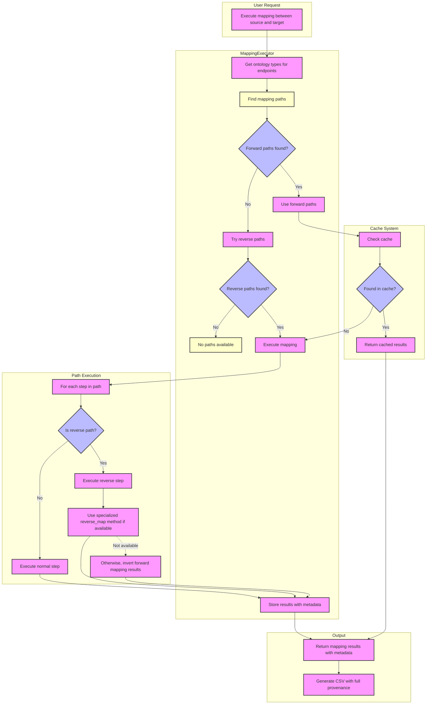

# Bidirectional Mapping Flow

This document describes the bidirectional mapping flow implemented in the Biomapper framework.

## Flow Diagram



## Explanation of the Bidirectional Flow

1. **User Request**: A request is made to execute mapping between a source and target endpoint.

2. **Ontology Type Resolution**: The executor retrieves the ontology types for the source and target endpoints from the database.

3. **Path Finding**:
   - First, the executor searches for forward paths (source → target).
   - If no forward paths are found and bidirectional=True, it searches for reverse paths (target → source).

4. **Cache Check**:
   - Before executing a path, the system checks if the mapping already exists in the cache.
   - If found in cache, the cached results are returned immediately.

5. **Path Execution**:
   - For each step in the selected path:
     - If it's a normal (forward) path, execute the step normally.
     - If it's a reverse path, check if the client has a specialized `reverse_map_identifiers` method.
     - If available, use the specialized method; otherwise, invert the results of a forward mapping.

6. **Result Storage and Metadata**:
   - Store mapping results in the cache with detailed metadata:
     - `confidence_score`: Calculated based on path characteristics
     - `hop_count`: Number of steps in the mapping path
     - `mapping_direction`: "forward" or "reverse"
     - `mapping_path_details`: Detailed information about the path used

7. **Result Output**:
   - Return mapping results to the caller.
   - Generate a comprehensive CSV file with full provenance information.

## Key Components

### 1. ReversiblePath Wrapper

The `ReversiblePath` class is a key component that wraps a `MappingPath` object and provides the ability to execute it in reverse:

```python
class ReversiblePath:
    def __init__(self, original_path, is_reverse=False):
        self.original_path = original_path
        self.is_reverse = is_reverse
        
    @property
    def steps(self):
        if not self.is_reverse:
            return self.original_path.steps
        else:
            # Return steps in reverse order
            return sorted(self.original_path.steps, key=lambda s: -s.step_order)
```

### 2. Bidirectional Path Finding

The `_find_mapping_paths` method has been enhanced to support bidirectional search:

```python
async def _find_mapping_paths(self, session, source_ontology, target_ontology, bidirectional=False):
    # First try to find forward paths
    forward_paths = await self._find_direct_paths(session, source_ontology, target_ontology)
    paths = [ReversiblePath(path, is_reverse=False) for path in forward_paths]
    
    # If bidirectional and no forward paths found, search for reverse paths
    if bidirectional and not paths:
        reverse_paths = await self._find_direct_paths(session, target_ontology, source_ontology)
        paths.extend([ReversiblePath(path, is_reverse=True) for path in reverse_paths])
    
    return paths
```

### 3. Reverse Step Execution

The `_execute_mapping_step` method includes specialized handling for reverse execution:

```python
async def _execute_mapping_step(self, step, input_values, is_reverse=False):
    client_instance = await self._load_client(step.mapping_resource)
    
    if not is_reverse:
        # Normal forward execution
        return await client_instance.map_identifiers(input_values)
    else:
        # Reverse execution - try specialized reverse method first
        if hasattr(client_instance, "reverse_map_identifiers"):
            return await client_instance.reverse_map_identifiers(input_values)
            
        # Fall back to inverting the results of forward mapping
        # ...
```

## Usage Example

```python
# Execute mapping with bidirectional support
results = await executor.execute_mapping(
    source_endpoint_name="UKBB_Protein",
    target_endpoint_name="Arivale_Protein",
    input_data=source_identifiers,
    use_cache=True,
    mapping_direction="forward",
    try_reverse_mapping=True,  # Enable bidirectional search
)
```

## Benefits of Bidirectional Mapping

1. **Increased Coverage**: By attempting mapping in both directions, the system can find more mappings.
2. **Flexible Configuration**: Path configuration only needs to be defined in one direction; reverse paths can be derived automatically.
3. **Detailed Provenance**: The metadata includes information about the mapping direction, allowing for transparency.
4. **Confidence Scoring**: The confidence scoring system takes into account the direction of mapping, with a slight preference for forward mappings.