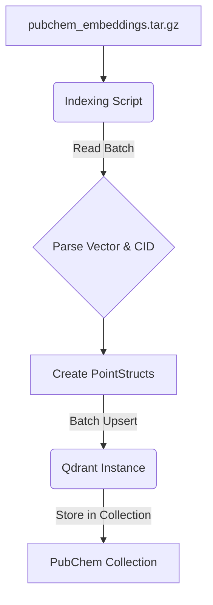

# Design: Qdrant Setup and PubChem Embedding Indexing

## 1. Introduction

This document outlines the technical design for setting up Qdrant and the script for indexing PubChem embeddings. This is a foundational component for the RAG mapping strategy.

## 2. Qdrant Setup

-   **Method:** Docker Compose will be used for ease of setup and reproducibility.
-   **`docker-compose.yml`:**
    ```yaml
    version: '3.8'
    services:
      qdrant:
        image: qdrant/qdrant:latest
        ports:
          - "6333:6333"  # gRPC
          - "6334:6334"  # REST API
        volumes:
          - ./qdrant_storage:/qdrant/storage # Persistent storage
        # environment:
          # - QDRANT__LOG_LEVEL=DEBUG # Optional: for more detailed logs
    ```
-   **Persistent Storage:** A local directory `./qdrant_storage` will be mapped to the container for data persistence.
-   **Configuration:** Default Qdrant configuration is generally sufficient. Specific collection parameters will be set by the indexing script.

## 3. Indexing Script (`scripts/rag/index_pubchem_embeddings.py`)

-   **Language:** Python
-   **Key Libraries:** `qdrant_client`, `tarfile`, `os`, `argparse`, `logging`, `json` (if embeddings or CIDs are in JSON lines within tarred files).

-   **Core Logic (`IndexManager` class or similar):
    -   `__init__(self, qdrant_host, qdrant_port, collection_name, vector_size=384, distance_metric="Cosine")`
    -   `connect_qdrant(self)`: Initializes `QdrantClient`.
    -   `create_collection_if_not_exists(self)`: Checks if collection exists. If not, creates it using `qdrant_client.http.models.VectorParams` and `Distance`.
    -   `process_embedding_archive(self, archive_path: str, batch_size: int = 100)`:
        1.  Opens the `.tar.gz` archive.
        2.  Iterates through members of the tarfile.
        3.  For each member (assumed to be a file containing one embedding and CID):
            -   Extracts/reads the file content.
            -   Parses the content to get the vector (list of floats) and PubChem CID (string). (Exact parsing logic depends on the internal format of files in the tarball. Assuming simple text or JSON lines for now.)
            -   Collects `PointStruct` objects: `PointStruct(id=int(cid), vector=vector, payload={"pubchem_cid": cid})`. Note: Qdrant point IDs can be integers or UUIDs. If CIDs are large, they might need hashing or mapping to integer IDs if integer IDs are preferred for some reason, or use string CIDs directly if Qdrant version supports it well for IDs.
            -   When `batch_size` points are collected, call `upload_batch()`.
        4.  Upload any remaining points after the loop.
    -   `upload_batch(self, points: List[PointStruct])`: Uses `qdrant_client.upsert()`.
    -   Logging throughout the process (progress, errors).

-   **Command-Line Interface (using `argparse`):
    ```bash
    python scripts/rag/index_pubchem_embeddings.py \
        --archive_path /path/to/pubchem_embeddings.tar.gz \
        --qdrant_host localhost \
        --qdrant_port 6333 \
        --collection_name pubchem_bge_small_v1_5 \
        --batch_size 256
    ```

## 4. Data Flow for Indexing



## 5. Error Handling in Script
-   File I/O errors (archive not found, corrupted archive).
-   Parsing errors for individual embedding files.
-   Qdrant connection errors.
-   Qdrant API errors during collection creation or upsertion.
-   Graceful shutdown and logging of errors.

## 6. Assumptions
-   The format of files within `pubchem_embeddings.tar.gz` is consistent and known (e.g., one file per compound, containing its vector and CID in a parsable way).
-   Sufficient disk space for Qdrant storage and temporary extraction of archive contents if needed.
-   Network access to the Qdrant instance from where the script is run.

## 7. Future Considerations (Post-MVP)
-   Script resumability: Store progress (e.g., last processed filename within the tar) to allow resuming an interrupted indexing job.
-   Parallel processing: If parsing individual files is slow, explore parallelizing that step.
