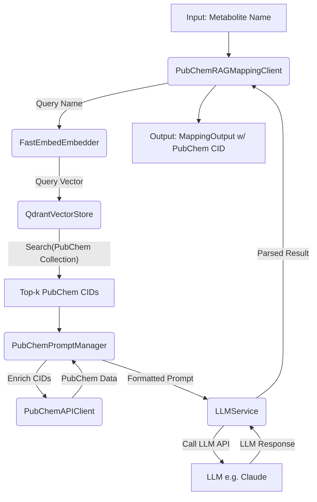

# Design: RAG-Based Mapping Feature

## 1. Introduction

This document outlines the technical design for the RAG-Based Mapping Feature, focusing on the `PubChemRAGMappingClient` and its components. It expands upon the concepts in `/home/ubuntu/biomapper/roadmap/technical_notes/rag/rag_strategy.md`.

## 2. System Architecture

The RAG mapping workflow involves the following components integrated into the `PubChemRAGMappingClient`:

## 3. Component Design

### 3.1. `PubChemRAGMappingClient(BaseRAGMapper, MappingClient)`
-   **Location:** `biomapper.mapping.rag.pubchem_client` (new module)
-   **Responsibilities:** Orchestrates the RAG workflow.
    -   `__init__(self, embedder, vector_store, prompt_manager, llm_service, settings)`: Injects dependencies.
    -   `map_identifiers(self, queries: List[str], **kwargs) -> MappingOutput`: Implements `MappingClient` interface. Iterates `queries`, calls `super().map_query()` (from `BaseRAGMapper`), and adapts results.
    -   `_generate_matches(self, query: str, context: List[Document], **kwargs) -> Optional[EntityMapping]`: Implements abstract method from `BaseRAGMapper`. This method will use the `LLMService` to get the LLM's adjudication based on the prompt generated by `PubChemPromptManager` using the `query` and `context` (enriched PubChem candidates).
    -   `get_client_info()`: Returns client metadata.

### 3.2. `FastEmbedEmbedder(BaseEmbedder)`
-   **Location:** `biomapper.mapping.rag.embedder` (or a new `fastembed_embedder.py`)
-   **Responsibilities:** Embeds text using FastEmbed.
    -   `__init__(self, model_name: str = "BAAI/bge-small-en-v1.5", cache_dir: Optional[str] = None, threads: Optional[int] = None)`: Initializes FastEmbed model.
    -   `embed_texts(self, texts: List[str]) -> List[List[float]]`: Returns list of embeddings.
    -   `embed_query(self, query: str) -> List[float]`: Returns single embedding.

### 3.3. `QdrantVectorStore(BaseVectorStore)`
-   **Location:** `biomapper.mapping.rag.vector_store` (or a new `qdrant_store.py`)
-   **Responsibilities:** Interacts with Qdrant.
    -   `__init__(self, host: str, port: int, collection_name: str, api_key: Optional[str] = None, **kwargs)`: Initializes Qdrant client.
    -   `search(self, query_embedding: List[float], top_k: int = 5, min_similarity: Optional[float] = None, alpha: Optional[float] = None, **kwargs) -> List[Document]`: 
        - Searches Qdrant for the top-k most similar vectors.
        - Applies similarity filtering based on either `min_similarity` (fixed threshold) or `alpha` (statistical significance level).
        - If `alpha` is provided, calculates the minimum required cosine similarity for statistical significance using `betaincinv(1/2, (n-1)/2, 1-alpha)` where n is the embedding dimension (384 for BGE Small).
        - Returns `Document` objects containing PubChem CIDs and similarity scores that meet the threshold criteria.
    -   `calculate_min_similarity(self, alpha: float, dim: int = 384) -> float`: Helper method to calculate the minimum statistically significant cosine similarity based on embedding dimensionality and alpha value.
    -   `calculate_similarity_p_value(self, similarity: float, dim: int = 384) -> float`: Helper method to calculate the p-value for a given cosine similarity using `1 - betainc(1/2, (n-1)/2, similarity**2)`.
    -   `add_documents(self, documents: List[Document])`: For batch indexing (used by separate indexing script).

### 3.4. `PubChemAPIClient`
-   **Location:** `biomapper.clients.pubchem_client` (new module or extend existing if one is planned)
-   **Responsibilities:** Fetches data from PubChem PUG REST/View.
    -   `get_compound_details(self, cid: str) -> Dict[str, Any]`: Fetches canonical name, synonyms, formula, InChIKey, SMILES for a given PubChem CID. Handles rate limiting and errors.

### 3.5. `PubChemPromptManager(BasePromptManager)`
-   **Location:** `biomapper.mapping.rag.pubchem_client` (with `PubChemRAGMappingClient`)
-   **Responsibilities:** Creates prompts for the LLM.
    -   `__init__(self, pubchem_api_client: PubChemAPIClient, template_path: Optional[str] = None)`
    -   `get_prompt(self, query: str, context_documents: List[Document], **kwargs) -> str`:
        1.  Extracts PubChem CIDs from `context_documents`.
        2.  Uses `PubChemAPIClient` to fetch detailed info for each CID.
        3.  Formats the `query` and enriched candidate info into a JSON prompt string based on a template. The template will instruct the LLM to return a JSON object with fields like `best_match_cid`, `confidence` (HIGH/MEDIUM/LOW/NONE), `justification`, `original_query`.

### 3.6. `LLMService`
-   **Location:** `biomapper.services.llm_service` (new module)
-   **Responsibilities:** Interacts with the LLM API.
    -   `__init__(self, api_key: str, model_name: str = "claude-3-opus-20240229", **kwargs)`: Configures LLM client (e.g., Anthropic).
    -   `get_completion(self, prompt: str, max_tokens: int = 1000) -> Dict[str, Any]`: Sends prompt, receives JSON response, parses it. Handles API errors.

## 4. Data Models
-   Leverage `biomapper.mapping.base.EntityMapping`, `biomapper.mapping.base.MappingOutput`.
-   `biomapper.mapping.rag.base_rag.Document` for passing data between vector store and prompt manager.

## 5. Configuration
-   All settings (Qdrant URL, collection, LLM API key, model names) managed via `biomapper.config.Settings`.

## 6. Error Handling
-   Each component will log errors and raise specific exceptions (e.g., `QdrantConnectionError`, `LLMAPIError`, `PubChemAPIError`).
-   The `PubChemRAGMappingClient` will catch these and populate `MappingError` in `MappingOutput`.

## 7. Testing Strategy
-   Unit tests for each new class and method.
-   Integration tests for the `PubChemRAGMappingClient` workflow (may require mocking external services like Qdrant, PubChem API, LLM API).
-   End-to-end tests with a small, local Qdrant instance and sample data.
