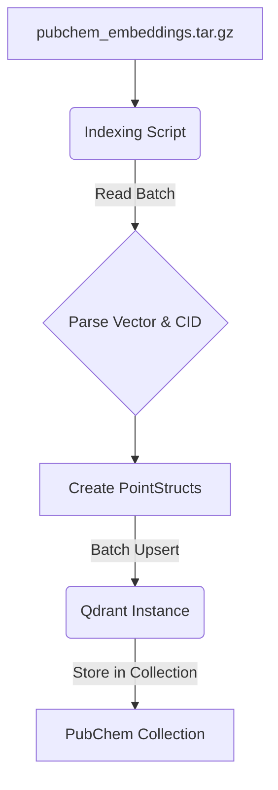

# Design: Qdrant Setup and PubChem Embedding Indexing

## 1. Introduction

This document outlines the technical design for setting up Qdrant and the script for indexing filtered PubChem embeddings. This infrastructure is essential for the `PubChemRAGMappingClient`. Given the size of the full PubChem embeddings dataset (~50GB compressed, ~700GB decompressed), we will implement a preprocessing step to filter for biologically relevant compounds before indexing.

## 2. Qdrant Setup

-   **Method:** Docker Compose (`docker-compose.yml`).
-   **Image:** `qdrant/qdrant:latest` (or a specific stable version).
-   **Configuration:**
    -   Map a local directory to `/qdrant/storage` for persistence.
    -   Expose Qdrant gRPC (default 6334) and HTTP (default 6333) ports.
    -   Example `docker-compose.yml`:
        ```yaml
        version: '3.8'
        services:
          qdrant:
            image: qdrant/qdrant:latest
            ports:
              - "6333:6333"
              - "6334:6334"
            volumes:
              - ./qdrant_storage:/qdrant/storage
        # To run: docker-compose up -d
        # To stop: docker-compose down
        ```
-   A `README.md` in the directory containing the `docker-compose.yml` will explain setup and basic management.

## 3. PubChem Preprocessing and Filtering

Given the significant size of the full PubChem embeddings dataset (~50GB compressed, ~700GB decompressed for ~894k compounds), we'll implement a preprocessing step to filter the dataset down to biologically relevant compounds. This will improve both performance and precision for metabolite mapping tasks.

The PubChem embeddings are available in compressed chunks at `/procedure/data/local_data/PUBCHEM_FASTEMBED/compressed_chunks/`, with decompression instructions provided in `/procedure/data/local_data/PUBCHEM_FASTEMBED/DECOMPRESSION_GUIDE.md`. The filtering process will need to follow these instructions when working with the compressed data.

### 3.1. Filtering Script (`scripts/rag/filter_pubchem_embeddings.py`)

-   **Language:** Python
-   **Key Libraries:**
    -   File manipulation libraries as required by the decompression guide (specific formats TBD after reviewing `/procedure/data/local_data/PUBCHEM_FASTEMBED/DECOMPRESSION_GUIDE.md`)
    -   `pubchempy` (for fetching metadata about compounds)
    -   `pandas` (for data manipulation)
    -   `numpy` (for handling vectors)
    -   `requests` (for API calls)

-   **Initial Implementation Steps:**
    1. Review the decompression guide at `/procedure/data/local_data/PUBCHEM_FASTEMBED/DECOMPRESSION_GUIDE.md` to understand:
       - The exact format of the compressed chunks
       - Required decompression procedures
       - Structure of the embedded vectors
       - Relationship between filenames/data and PubChem CIDs
    2. Adapt the filtering implementation based on these specifics

-   **Filtering Criteria:** The script will select compounds based on multiple biological relevance indicators:
    1. **Bioactivity-based filters:**
       - Compounds active in one or more biological assays
       - Chemical probes with well-characterized biological activity
       
    2. **Database cross-reference filters:**
       - Compounds with HMDB IDs (Human Metabolome Database)
       - Compounds with ChEBI IDs (Chemical Entities of Biological Interest)
       - Compounds with links to DrugBank
       
    3. **Pharmacological information filters:**
       - Compounds with associated pharmacological actions (`has_pharm`)
       - Compounds with MeSH terms (`has_mesh`)
       
    4. **Property-based filters (optional):**
       - Molecular weight < 500 g/mol
       - LogP ≤ 5
       - Hydrogen bond donors ≤ 5
       - Hydrogen bond acceptors ≤ 10

-   **Implementation Strategy:**
    1. **Create biological relevance allowlist:**
       - Download data from HMDB, ChEBI, DrugBank, and PubChem BioAssay
       - Extract and consolidate all PubChem CIDs from these sources
       - Prioritize metabolites (HMDB) and compounds with known biological roles (ChEBI) to directly address the current low mapping success rate (0.2-0.5%)
       - Store this allowlist as a simple text file of CIDs for reuse
    2. **Efficient filtering during decompression:**
       - Process the compressed chunks in `/procedure/data/local_data/PUBCHEM_FASTEMBED/compressed_chunks/` according to the decompression guide
       - For each chunk, only extract embeddings for CIDs present in our allowlist
       - This avoids decompressing the entire 700GB dataset
    3. **Optimize for Qdrant:**
       - Format the filtered embeddings for efficient Qdrant ingestion
       - Include appropriate metadata (CID and potentially source database) in the payload
    4. **Validation:**
       - Test the filtered dataset with sample metabolite mapping tasks
       - Compare mapping success rates with the current baseline (0.2-0.5%)

-   **Expected Outcome:**
    - Reduction to approximately 100k-150k compounds (10-15% of original size)
    - Filtered dataset size: ~5-8GB compressed, ~70-100GB decompressed
    - Higher biological relevance for Biomapper's mapping tasks

### 3.2. Pre-existing Biological Relevance Lists

Rather than making individual API calls for each PubChem CID (which would be prohibitively slow), we will use pre-existing, downloadable lists of biologically relevant PubChem CIDs:

-   **Primary data sources for filtering:**
    - **HMDB (Human Metabolome Database):** Download their data with PubChem CID mappings (~114,000 metabolites)
    - **ChEBI (Chemical Entities of Biological Interest):** Download their complete dataset with PubChem cross-references
    - **DrugBank:** Access their downloadable files with PubChem CID mappings
    - **PubChem BioAssay Active Compounds:** Download list of CIDs for compounds with documented biological activity

-   **Consolidated approach:**
    1. Download and parse these databases to extract PubChem CIDs
    2. Create a unified allowlist of biologically relevant CIDs
    3. Use this allowlist to filter the embeddings during decompression
    
-   **PubChem PUG REST API:** Used only sparingly for verification or enrichment, not for bulk processing

### 3.3. Configurability

-   Filtering criteria will be configurable via command-line arguments or a config file
-   Default settings will optimize for metabolite mapping
-   Options to enable/disable specific filtering criteria

### 3.4. Implementation Considerations and Risk Mitigation

-   **Data Format Verification:**
    - Before full implementation, create a proof-of-concept script that tests decompression and parsing of a single chunk
    - Document the exact format of compressed chunks and CID storage based on the decompression guide

-   **Resource Management:**
    - Implement disk space monitoring to prevent out-of-space errors
    - Define minimum RAM requirements (recommend ≥16GB) and implement batch processing to limit memory usage
    - Estimate processing time (potentially several hours) and communicate this in logs

-   **Database Access Planning:**
    - Document registration requirements for each database (especially DrugBank)
    - Implement a modular approach where individual database extractors can fail without aborting the entire process
    - Cache downloaded database files with checksums to avoid repeated downloads

-   **Error Recovery:**
    - Implement checkpointing in the filtering script (e.g., track processed chunks)
    - Allow resuming from the last successfully processed chunk
    - Generate periodic progress reports

-   **PubChem ID Format Handling:**
    - Normalize CID formats (strip prefixes like "CID:" if present)
    - Handle potential leading zeros or other format inconsistencies
    - Validate CIDs against expected format patterns

-   **Validation Against Project Goals:**
    - Create a small test set of known challenging metabolite mappings
    - Run mapping tests on this set using the filtered embeddings
    - Compare success rates to the current baseline (0.2-0.5%)
    - Document findings and potentially adjust filtering criteria based on results

## 4. Indexing Script (`scripts/rag/index_pubchem_embeddings.py`)

-   **Language:** Python
-   **Key Libraries:**
    -   `qdrant_client` (for Qdrant interaction)
    -   `tarfile` (for decompressing the archive)
    -   `argparse` (for command-line arguments)
    -   `logging` (for progress and error reporting)
    -   `os`, `pathlib` (for file system operations)
    -   `numpy` (if direct vector manipulation from file is needed, format dependent)

-   **Core Logic (`IndexManager` class or similar):**
    -   `__init__(self, qdrant_host, qdrant_port, collection_name, vector_size=384, distance_metric="Cosine")`
    -   `connect_qdrant(self)`: Initializes `QdrantClient`.
    -   `create_collection_if_not_exists(self)`: Checks if collection exists. If not, creates it using `qdrant_client.http.models.VectorParams` and `Distance`.
    -   `process_embedding_archive(self, archive_path: str, batch_size: int = 100)`:
        1.  Opens the `.tar.gz` archive.
        2.  Iterates through members of the tarfile.
        3.  For each member (assumed to be a file containing one embedding and CID):
            -   Extracts/reads the file content.
            -   Parses the content to get the vector (list of floats) and PubChem CID (string). 
            -   Collects `PointStruct` objects: `PointStruct(id=int(cid), vector=vector, payload={"pubchem_cid": cid})`.
            -   When `batch_size` points are collected, call `upload_batch()`.
        4.  Upload any remaining points after the loop.
    -   `upload_batch(self, points: List[PointStruct])`: Uses `qdrant_client.upsert()`.
    -   Logging throughout the process (progress, errors).

-   **Command-Line Interface (using `argparse`):**
    ```bash
    python scripts/rag/index_pubchem_embeddings.py \
        --archive_path /path/to/pubchem_embeddings.tar.gz \
        --qdrant_host localhost \
        --qdrant_port 6333 \
        --collection_name pubchem_bge_small_v1_5 \
        --batch_size 256
    ```

## 4. Data Flow for Indexing



## 5. Error Handling in Script
-   File I/O errors (archive not found, corrupted archive).
-   Parsing errors for individual embedding files.
-   Qdrant connection errors.
-   Qdrant API errors during collection creation or upsertion.
-   Graceful shutdown and logging of errors.

## 6. Assumptions
-   The format of files within `pubchem_embeddings.tar.gz` is consistent and known (e.g., one file per compound, containing its vector and CID in a parsable way).
-   Sufficient disk space for Qdrant storage and temporary extraction of archive contents if needed.
-   Network access to the Qdrant instance from where the script is run.

## 7. Future Considerations (Post-MVP)
-   Script resumability: Store progress (e.g., last processed filename within the tar) to allow resuming an interrupted indexing job.
-   Parallel processing: If parsing individual files is slow, explore parallelizing that step.
