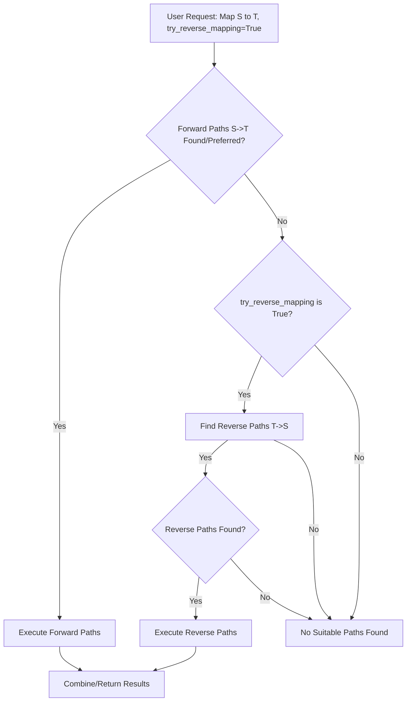

# Comprehensive Guide to Bidirectional Mapping in Biomapper

This document provides a comprehensive guide to the bidirectional mapping capabilities within the Biomapper framework. It covers three key aspects:
1.  **Reverse Path Execution**: The ability to find and execute mapping paths in a reverse direction (target -> source).
2.  **Bidirectional Validation**: A process to validate successful forward mappings by attempting a reverse mapping from the target back to the original source.
3.  **Performance Optimizations & Configuration**: Enhancements made to improve the speed and efficiency of mapping operations, especially when bidirectional features are used, and how to configure them.

**Foundational Requirement**: All mapping operations depend on a correctly configured `metamapper.db` with populated `Ontology` and `Property` tables. This allows the `MappingExecutor` to understand entity types.

## 1. Reverse Path Execution Flow

This flow is generally triggered when `try_reverse_mapping=True` is passed to `MappingExecutor.execute_mapping()` and forward paths are insufficient or not preferred.

### Flow Diagram (Conceptual for Reverse Path Execution)



### Explanation of Reverse Path Execution

1.  **User Request**: A request to map identifiers, potentially with `try_reverse_mapping=True`.
2.  **Path Finding**: The executor first searches for forward paths (source → target).
3.  **Reverse Search (Conditional)**: If no suitable forward paths are found (or if specified by strategy) and `try_reverse_mapping=True`, it searches for reverse paths (target → source).
4.  **Path Execution**: If a reverse path is chosen:
    *   Steps are executed in reverse order.
    *   Clients might use specialized `reverse_map_identifiers` methods.
5.  **Result Handling**: Results indicate `mapping_direction` as "reverse".

## 2. Bidirectional Validation Flow

This flow is triggered when `validate_bidirectional=True` is passed to `execute_mapping()`. It occurs *after* a successful forward mapping.

### Flow Diagram (Bidirectional Validation)

```mermaid
flowchart TD
    subgraph MainMappingProcess["Main Forward Mapping Process"]
        A[User Request: Map S to T with validate_bidirectional=True]
        B[Execute Forward Mapping S->T]
        C{Forward Mapping Successful?}
        D[Forward Results (S_ID -> T_ID_List)]
    end

    subgraph ValidationProcess["Bidirectional Validation (if validate_bidirectional=True and Forward Success)"]
        E[Extract Target IDs (T_ID) from D]
        F[Find Reverse Path T_Ontology -> S_Ontology]
        G{Reverse Path Found?}
        H[Execute Reverse Mapping (T_ID_List -> S_ID_Validated_List)]
        I[No Reverse Path / Reverse Mapping Failed]
    end

    subgraph ResultReconciliation["Result Reconciliation"]
        J[Call _reconcile_bidirectional_mappings]
        K[Enrich Forward Results with 'validation_status']
        L[Final Results: {S_ID: {target_ids: T_ID_List, validation_status: 'Validated'/'UnidirectionalSuccess'}}]
    end

    M[Return Final Enriched Results]

    A --> B
    B --> C
    C -- Yes --> D
    C -- No --> M # Return original forward results/failures
    D --> E
    E --> F
    F -- Yes --> G
    F -- No --> I
    G -- Yes --> H
    G -- No --> I
    H --> J
    I --> J
    J --> K
    K --> L
    L --> M

    classDef process fill:#f9f,stroke:#333,stroke-width:2px;
    classDef decision fill:#bbf,stroke:#333,stroke-width:2px;
    classDef data fill:#ffc,stroke:#333,stroke-width:2px;
    classDef important fill:#ccf,stroke:#333,stroke-width:2px;

    class A,B,E,H,J,K,L,M process;
    class C,F,G decision;
    class D data;
    class ValidationProcess,ResultReconciliation important;
```

### Explanation of Bidirectional Validation Flow

1.  **User Request**: `execute_mapping` with `validate_bidirectional=True`.
2.  **Forward Mapping**: Standard forward mapping occurs first.
3.  **Validation Trigger**: If forward mapping is successful, validation proceeds.
4.  **Extract Targets**: Collect unique target IDs from successful forward maps.
5.  **Find Reverse Path**: Look for paths from target ontology back to original source ontology.
6.  **Execute Reverse Mapping**: Map collected target IDs back using `_execute_reverse_mapping`.
7.  **Reconcile Results (`_reconcile_bidirectional_mappings`)**: Compares forward and reverse results. Assigns `validation_status`:
    *   **"Validated"**: If a target ID maps back to the original source ID.
    *   **"UnidirectionalSuccess"**: If forward mapping succeeded but reverse validation did not confirm the original source ID, or if reverse mapping couldn't be performed.
8.  **Enrich and Return**: Forward results are enriched with `validation_status`. All original forward mappings are preserved.

### Key Components for Bidirectional Validation

*   **`validate_bidirectional: bool`**: Parameter in `execute_mapping()` to trigger validation.
*   **`_execute_reverse_mapping()`**: Internal method for the reverse mapping step of validation.
*   **`_reconcile_bidirectional_mappings()`**: Adds `validation_status` to results.
*   **`validation_status: str`**: Field in mapping results ("Validated", "UnidirectionalSuccess").

## 3. Performance Optimizations & Configuration

The `MappingExecutor` incorporates several optimizations to enhance performance, especially for complex or large-scale mapping tasks, including those using bidirectional features.

### Overview of Optimizations

1.  **Concurrent Path Processing**: Uses `asyncio.gather()` to find forward and reverse paths simultaneously if `try_reverse_mapping=True`, reducing path discovery time.
    ```python
    # Conceptual: Concurrent path finding
    # forward_task = self._find_direct_paths(session, source_ontology, target_ontology)
    # if try_reverse_mapping:
    #     reverse_task = self._find_direct_paths(session, target_ontology, source_ontology)
    #     forward_paths, reverse_paths = await asyncio.gather(forward_task, reverse_task)
    ```

2.  **Path Caching**: Implements a thread-safe cache (`self._path_cache`) for path query results with time-based expiration and size limits (LRU eviction) to avoid redundant database calls.
    *   Thread safety with `asyncio.Lock`.
    *   Configurable cache size and expiry.

3.  **Batched Processing**: Divides large lists of input identifiers into smaller batches for more manageable processing.
    ```python
    # Conceptual: Batch creation
    # batches = [input_ids_list[i:i+batch_size] for i in range(0, len(input_ids_list), batch_size)]
    ```

4.  **Concurrent Batch Execution**: Processes multiple batches in parallel using an `asyncio.Semaphore` to control the degree of concurrency, preventing resource exhaustion.
    ```python
    # Conceptual: Concurrent batch processing
    # semaphore = asyncio.Semaphore(max_concurrent_batches)
    # batch_tasks = [process_batch(batch) for batch in batches]
    # await asyncio.gather(*batch_tasks)
    ```

5.  **Confidence Filtering**: Calculates a `confidence_score` for each mapping based on path length (hops), direction (forward/reverse), and types of resources used. Mappings below a `min_confidence` threshold (if specified) can be filtered out.
    The score considers:
    *   Number of hops.
    *   Path direction (reverse paths may have slightly lower intrinsic confidence).
    *   Types of mapping resources (e.g., curated DB vs. LLM prediction).

6.  **Performance Monitoring**: Tracks detailed metrics for mapping sessions and individual path executions. These metrics are logged and can be stored in the database for analysis.

### Configuration Options

Performance-related parameters can be set in the `MappingExecutor` constructor or overridden in the `execute_mapping` method.

**Constructor Parameters:**
*   `path_cache_size: int = 100`: Max paths in cache.
*   `path_cache_expiry_seconds: int = 300`: Cache item lifetime.
*   `max_concurrent_batches: int = 5` (default for constructor): Default max concurrent batches for `execute_mapping` if not specified there.
*   `enable_metrics: bool = True`: Enable/disable performance metric tracking.

**`execute_mapping` Method Parameters (selected):**
*   `batch_size: int = 250`: Number of identifiers per batch.
*   `max_concurrent_batches: Optional[int] = None`: Overrides constructor default. Max batches processed concurrently.
*   `min_confidence: float = 0.0`: Minimum confidence score for results to be included.
*   `max_hop_count: Optional[int] = None`: Filters out paths longer than this.
*   `try_reverse_mapping: bool = False`: Enables search for reverse paths if forward ones fail/not preferred.
*   `validate_bidirectional: bool = False`: Enables the bidirectional validation flow.

**Performance Settings Summary & Recommendations:**

| Parameter                 | Description                             | Default (Executor/Method) | Recommendation                                  |
|---------------------------|-----------------------------------------|---------------------------|-------------------------------------------------|
| `path_cache_size`         | Max paths in cache                      | 100                       | Increase for diverse, frequent mapping tasks      |
| `path_cache_expiry_seconds` | Cache expiry time (seconds)             | 300                       | Lower for rapidly changing path configurations    |
| `batch_size`              | Identifiers per batch                   | 250 (method)              | 100-500; adjust based on identifier complexity  |
| `max_concurrent_batches`  | Max concurrent batches                  | 5 (executor/method)       | 2-3 (constrained env), 5 (standard), 8-10 (HPC) |
| `max_hop_count`           | Max hops in paths                       | None (method)             | 2 or 3 for faster results, balances speed/coverage |
| `min_confidence`          | Min confidence score threshold        | 0.0 (method)              | 0.2-0.5 for higher quality, context-dependent   |
| `enable_metrics`          | Enable performance metrics tracking     | True (executor)           | Keep True for monitoring, disable if overhead critical |

### Database Schema for Performance Metrics

To support performance monitoring, the database schema (typically `mapping_cache.db`) includes:
1.  **`MappingSession` model enhancements**: Fields like `batch_size`, `max_concurrent_batches`, `total_execution_time`, `success_rate` may be added or updated by the `MappingSessionLog` or similar mechanisms.
2.  **`ExecutionMetric` model**: Stores detailed, timestamped metrics (name, type, value) linked to mapping sessions for trend analysis.

### Performance Results (Conceptual Benchmarks)

Optimizations have shown significant improvements:
*   **Path Finding**: Can be substantially faster with concurrency and caching.
*   **Batch Processing & Concurrency**: Can lead to 2-5x faster processing for large datasets (>1000 identifiers) by better utilizing resources.
*   **Memory Usage**: More efficient due to controlled concurrency and batching.

## 4. Usage Examples

### Basic Usage with Bidirectional Features

```python
from biomapper.core.mapping_executor import MappingExecutor
# Assuming settings are configured for DB URLs, etc.

async def main():
    executor = MappingExecutor(
        path_cache_size=200, 
        path_cache_expiry_seconds=600,
        max_concurrent_batches=8 # Default for subsequent calls unless overridden
    )
    
    source_ids = ["P12345", "P67890", "Q00001"] # Example UniProt IDs

    results = await executor.execute_mapping(
        source_endpoint_name="UKBB_Protein", # Example source endpoint
        target_endpoint_name="Arivale_Protein", # Example target endpoint
        input_identifiers=source_ids,
        source_property_name="UNIPROTKB_AC", # Specify actual source property
        target_property_name="ARIVALE_PROTEIN_ID", # Specify actual target property
        try_reverse_mapping=True,      # Enable reverse path search if needed
        validate_bidirectional=True,   # Enable bidirectional validation
        batch_size=100,                # Override batch size for this call
        min_confidence=0.1,
        max_hop_count=3
    )

    for source_id, mapping_info_dict in results.items():
        if mapping_info_dict:
            for target_id, info in mapping_info_dict.items(): # Results are dict of dicts
                status = info.get("validation_status", "N/A")
                confidence = info.get("confidence_score", 0.0)
                path_details = info.get("mapping_path_details", "N/A")
                print(f"Source: {source_id} -> Target: {target_id}, Confidence: {confidence:.2f}, Validation: {status}")
        else:
            print(f"Source: {source_id}, Failed to map or filtered out")

# import asyncio
# asyncio.run(main())
```

### Mapping Large Datasets Efficiently

```python
# (Continuing from previous example context)
async def map_large_dataset(executor: MappingExecutor, input_file: str, output_file: str):
    with open(input_file, 'r') as f:
        all_identifiers = [line.strip() for line in f if line.strip()]
    
    final_results = {}
    chunk_size = 1000 # Process 1000 identifiers at a time to manage memory for overall results

    for i in range(0, len(all_identifiers), chunk_size):
        chunk = all_identifiers[i:i+chunk_size]
        print(f"Processing chunk {i//chunk_size + 1}/{(len(all_identifiers) + chunk_size - 1) // chunk_size}")
        
        chunk_map_results = await executor.execute_mapping(
            source_endpoint_name="UKBB_Protein",
            target_endpoint_name="Arivale_Protein",
            input_identifiers=chunk,
            source_property_name="UNIPROTKB_AC",
            target_property_name="ARIVALE_PROTEIN_ID",
            try_reverse_mapping=True,
            validate_bidirectional=False, # May disable validation for speed on very large initial runs
            batch_size=250, # Executor's internal batching for this chunk
            max_concurrent_batches=executor.max_concurrent_batches, # Use executor's default or set explicitly
            max_hop_count=3,
            min_confidence=0.2
        )
        final_results.update(chunk_map_results)
    
    # Write output
    with open(output_file, 'w') as f:
        f.write("SourceID\tTargetID\tConfidence\tValidationStatus\tPathDetails\n")
        for source_id, mapping_info_dict in final_results.items():
            if mapping_info_dict:
                for target_id, info in mapping_info_dict.items():
                    confidence = info.get('confidence_score', 0.0)
                    validation_status = info.get('validation_status', 'N/A')
                    path_str = str(info.get('mapping_path_details', {}))
                    f.write(f"{source_id}\t{target_id}\t{confidence:.2f}\t{validation_status}\t{path_str}\n")
            else:
                 f.write(f"{source_id}\tNO_MAPPING_FOUND_OR_FILTERED\t0.0\tN/A\tN/A\n")
    print(f"Results written to {output_file}")

# Example usage:
# async def run_large_map():
#     executor = MappingExecutor(max_concurrent_batches=10, path_cache_size=250)
#     await map_large_dataset(executor, "large_input.txt", "large_output.tsv")
# asyncio.run(run_large_map())
```

## 5. Best Practices for Performance

1.  **Batch Sizing**: Adjust `batch_size` (default 250) based on identifier complexity and typical client API limits. Too small increases overhead; too large can lead to timeouts or memory issues with client responses.
2.  **Concurrency Control**: Set `max_concurrent_batches` based on available CPU/network resources. Start with defaults and adjust based on monitoring.
3.  **Path Caching**: Ensure `path_cache_size` is adequate if mapping many different source/target ontology type pairs repeatedly.
4.  **Confidence Filtering**: Use `min_confidence` to prune low-quality results early, especially with multi-hop paths or less reliable sources.
5.  **Hop Count Limiting**: `max_hop_count=2` or `3` can significantly speed up path discovery and execution by avoiding very long, often less reliable paths.

## 6. Monitoring & Debugging

Enable detailed logging to observe the mapping process:

```python
import logging
logging.getLogger("biomapper.core.mapping_executor").setLevel(logging.DEBUG)
# Also consider setting log levels for specific client loggers if needed
```

**Key Log Messages:**
*   Cache hits/misses for paths.
*   Batch creation and processing details.
*   Execution time per path or batch.
*   Success rates and error summaries.

**Performance Metrics Query:**

Access stored performance metrics from the database (e.g., `mapping_cache.db`):

```python
from sqlalchemy import select
from biomapper.db.cache_models import MappingSession, ExecutionMetric # Adjust import as per your project

async def get_session_metrics(session_id, async_db_session_factory):
    async with async_db_session_factory() as session:
        db_session_obj = await session.get(MappingSession, session_id)
        if not db_session_obj:
            print(f"Session {session_id} not found.")
            return None

        stmt = select(ExecutionMetric).where(ExecutionMetric.mapping_session_id == session_id)
        result = await session.execute(stmt)
        metrics = result.scalars().all()
        
        return {
            "session_info": db_session_obj.to_dict(), # Assuming a to_dict() method
            "detailed_metrics": [metric.to_dict() for metric in metrics]
        }

# Example usage (ensure async_db_session_factory is your session provider)
# metrics_data = await get_session_metrics("some_session_uuid", executor.async_cache_session_factory)
# if metrics_data:
#     print(metrics_data)
```

## 7. Overall Benefits

*   **Increased Coverage**: `try_reverse_mapping` helps find mappings otherwise missed.
*   **Higher Confidence**: `validate_bidirectional` provides stronger assurance for critical mappings.
*   **Improved Performance**: Optimizations allow efficient processing of larger datasets.
*   **Flexibility & Control**: Granular configuration options for tailoring performance.
*   **Transparency**: Detailed logging and metrics provide insight into the mapping process.

## 8. Future Enhancements (Potential)

*   Adaptive batch sizing based on real-time resource availability.
*   Caching of intermediate results for multi-hop paths.
*   Dynamic adjustment of confidence thresholds.
*   Predictive path selection to prioritize most likely successful paths.
*   Integration with distributed processing frameworks for extremely large tasks.

## Database Prerequisites (Reiteration)

Correct population of `metamapper.db` (Ontology, Property, MappingPath, etc.) is essential for all mapping functionalities, including path discovery for both forward and reverse directions, and for validation.