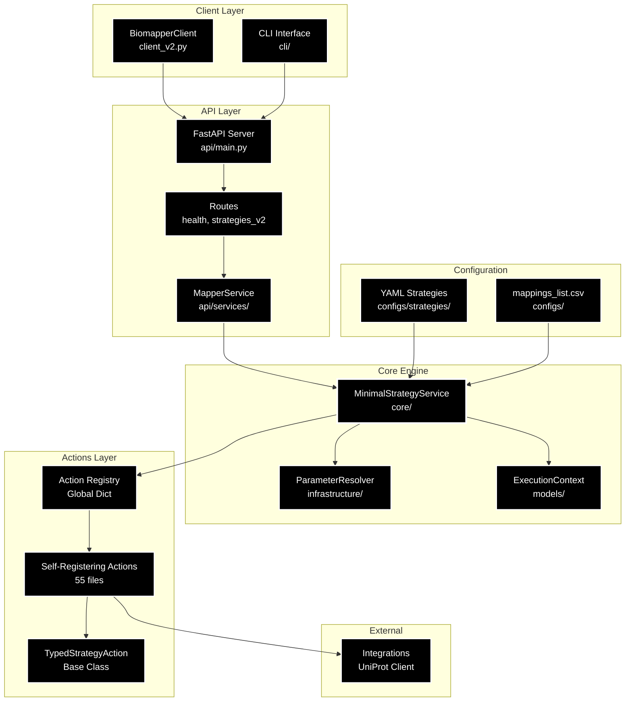

# Biomapper Source Architecture

## Overview

Biomapper is a **barebones, YAML-driven biological data harmonization system** built on a minimalist architecture that prioritizes simplicity, maintainability, and extensibility. The system follows a linear flow: Client → API → Strategy Service → Self-registering Actions.

### Key Design Principles

- **Minimal Dependencies**: Only essential components retained
- **Self-Registration**: Actions auto-register via decorators
- **YAML-Driven**: Strategies defined in declarative YAML files
- **Context Flow**: Shared dictionary passes through all components
- **Type Safety**: Progressive migration to typed actions with Pydantic models

## Architecture Diagram



## Module Overview

| Module | Files | Size | Purpose | Key Components |
|--------|-------|------|---------|----------------|
| **actions/** | 55 | 58% | Business logic for data processing | Self-registering actions, entity-specific processors, algorithms |
| **core/** | 18 | 19% | Strategy execution engine | MinimalStrategyService, ExecutionContext, ParameterResolver |
| **api/** | 11 | 11% | REST API server | FastAPI app, routes, MapperService wrapper |
| **client/** | 5 | 5% | Python client library | BiomapperClient, async/sync interfaces |
| **integrations/** | 4 | 4% | External service clients | UniProt historical resolver, base client |
| **cli/** | 2 | 2% | Command-line interface | Click commands, health checks |
| **configs/** | 1 | 1% | Configuration files | YAML strategies, mappings CSV |
| **data/** | 0 | - | Runtime data storage | Checkpoints, results, uploads |

**Total**: 97 Python files in barebones architecture

## Detailed Module Descriptions

### 1. Core Module (`/core/`) - The Execution Engine

The heart of biomapper, responsible for strategy orchestration.

#### Components:

| Component | Files | Purpose |
|-----------|-------|---------|
| **MinimalStrategyService** | `minimal_strategy_service.py` | Loads YAML strategies, resolves parameters, executes actions |
| **Infrastructure** | `parameter_resolver.py` | Handles `${variable}` substitution in YAML |
| **Models** | `execution_context.py` | Defines context structure passed between actions |
| **Standards** | 6 files | File loading, API validation, debug tracing |
| **Algorithms** | `efficient_matching.py` | Optimized matching algorithms |
| **Exceptions** | `exceptions.py` | Custom error types |

#### Key Features:
- Multi-pass parameter resolution with circular reference detection
- Environment variable substitution with defaults: `${VAR:-default}`
- Nested parameter references: `${parameters.data_file}`
- Type conversion for boolean/numeric values

### 2. Actions Module (`/actions/`) - Business Logic

Self-contained, reusable operations on biological data.

#### Organization:

```
actions/
├── entities/           # Entity-specific actions (30 files)
│   ├── proteins/       # UniProt, gene symbols
│   ├── metabolites/    # HMDB, InChIKey, CHEBI
│   └── chemistry/      # LOINC, clinical tests
├── algorithms/         # Reusable algorithms (4 files)
├── utils/              # Utilities (11 files)
│   └── data_processing/  # DataFrame operations
├── workflows/          # High-level orchestration (3 files)
├── io/                # Input/output operations (2 files)
└── reference/         # Reference data builders (1 file)
```

#### Registration Pattern:

```python
@register_action("MY_ACTION_NAME")
class MyAction(TypedStrategyAction[ParamsModel, ResultModel]):
    async def execute_typed(self, params, context):
        # Business logic here
        return ResultModel(...)
```

#### Available Action Types:

| Category | Count | Examples |
|----------|-------|----------|
| **Data Operations** | 15 | LOAD_DATASET, MERGE_DATASETS, FILTER_DATASET |
| **Protein Processing** | 8 | EXTRACT_UNIPROT, NORMALIZE_ACCESSIONS |
| **Metabolite Processing** | 7 | NIGHTINGALE_NMR_MATCH, CTS_BRIDGE |
| **Chemistry Processing** | 4 | EXTRACT_LOINC, FUZZY_TEST_MATCH |
| **Analysis & Reports** | 5 | CALCULATE_SET_OVERLAP, GENERATE_HTML_REPORT |
| **I/O Operations** | 2 | SYNC_TO_GOOGLE_DRIVE, EXPORT_DATASET |

### 3. API Module (`/api/`) - REST Interface

FastAPI-based REST API server.

#### Structure:

| Component | Files | Purpose |
|-----------|-------|---------|
| **main.py** | 1 | FastAPI app initialization, middleware, startup/shutdown |
| **routes/** | 3 | Health checks, strategy execution endpoints |
| **services/** | 1 | MapperService wrapping MinimalStrategyService |
| **core/** | 2 | Configuration, logging setup |
| **deps.py** | 1 | Dependency injection helpers |

#### Endpoints:

- `GET /api/health` - System health check
- `GET /api/strategies` - List available strategies
- `POST /api/strategies/{name}/execute` - Execute a strategy
- `GET /api/docs` - OpenAPI documentation

### 4. Client Module (`/client/`) - Python SDK

High-level Python interface for biomapper operations.

#### Components:

| File | Purpose |
|------|---------|
| **client_v2.py** | Primary client class with async/sync methods |
| **models.py** | Pydantic models for requests/responses |
| **utils.py** | Helper functions for SSE parsing |
| **exceptions.py** | Client-specific exceptions |

#### Key Features:
- Synchronous and asynchronous interfaces
- Server-Sent Events (SSE) for progress streaming
- Automatic retry logic with exponential backoff
- Type-safe request/response models

### 5. CLI Module (`/cli/`) - Command Interface

Click-based command-line interface.

#### Commands:

| Command | Purpose |
|---------|---------|
| `biomapper health` | Check system health |
| `biomapper test-import` | Verify core imports |
| `biomapper api` | Start API server |
| `biomapper strategies` | List available strategies |
| `biomapper info` | Show project information |

### 6. Integrations Module (`/integrations/`) - External Services

Clients for external biological databases.

#### Current Integrations:

| Client | Purpose | Used By |
|--------|---------|---------|
| **UniProtHistoricalResolverClient** | Resolve obsolete UniProt IDs | 2 protein actions |
| **BaseMappingClient** | Base class with caching | All clients |

### 7. Configs Module (`/configs/`) - Configuration

Strategy definitions and reference data.

#### Structure:

```
configs/
├── strategies/         # YAML strategy definitions
│   ├── basic/         # Simple single-step strategies
│   ├── advanced/      # Multi-step pipelines
│   └── experimental/  # In-development strategies
└── mappings_list.csv  # Reference mapping data
```

## Data Flow

### Strategy Execution Flow:

1. **Client Request**
   ```python
   client = BiomapperClient("http://localhost:8000")
   result = client.run("protein_harmonization", params)
   ```

2. **API Reception**
   - FastAPI validates request
   - Routes to `/api/strategies/{name}/execute`
   - Injects MapperService dependency

3. **Strategy Loading**
   - MinimalStrategyService loads YAML from `configs/strategies/`
   - ParameterResolver substitutes variables
   - Validates strategy structure

4. **Action Execution**
   - For each step in strategy:
     - Lookup action in global registry
     - Create action instance
     - Execute with current context
     - Update context with results

5. **Context Flow**
   ```python
   context = {
       "datasets": {"input": DataFrame, ...},
       "statistics": {"processed": 100, ...},
       "output_files": ["results.csv", ...],
       "current_identifiers": ["P12345", ...],
       "parameters": {original_params}
   }
   ```

6. **Response Stream**
   - Progress updates via SSE
   - Final result with statistics
   - Error handling with detailed messages

## Key Design Patterns

### 1. Decorator-Based Registration

```python
ACTION_REGISTRY = {}

def register_action(name: str):
    def decorator(cls):
        ACTION_REGISTRY[name] = cls
        return cls
    return decorator
```

### 2. Context Dictionary Pattern

- Single mutable dictionary passed through all components
- Actions read from and write to shared context
- Enables stateful pipeline execution without explicit state management

### 3. Parameter Resolution

```yaml
parameters:
  data_file: "${DATA_DIR:-/tmp}/input.csv"
  threshold: 0.8

steps:
  - action:
      params:
        input_file: "${parameters.data_file}"
        min_score: "${parameters.threshold}"
```

### 4. Typed vs Untyped Actions

| Type | Base Class | Use Case | Validation |
|------|------------|----------|------------|
| **Typed** | TypedStrategyAction | Business logic with defined schemas | Pydantic models |
| **Untyped** | BaseStrategyAction | Flexible/legacy actions | Runtime checks |

## Development Guidelines

### Adding a New Action:

1. **Choose appropriate location**:
   - Entity-specific: `actions/entities/{protein|metabolite|chemistry}/`
   - Algorithms: `actions/algorithms/`
   - Utilities: `actions/utils/`

2. **Implement with registration**:
   ```python
   from actions.typed_base import TypedStrategyAction
   from actions.registry import register_action
   
   @register_action("MY_NEW_ACTION")
   class MyNewAction(TypedStrategyAction[...]):
       async def execute_typed(self, params, context):
           # Implementation
   ```

3. **Action auto-registers on import** - no manual registration needed

### Creating a Strategy:

1. **Create YAML in `configs/strategies/`**:
   ```yaml
   name: my_strategy
   description: Strategy description
   parameters:
     input_file: "/path/to/data.csv"
   
   steps:
     - name: load_data
       action:
         type: LOAD_DATASET
         params:
           file_path: "${parameters.input_file}"
           output_key: "raw_data"
   ```

2. **Strategy auto-discovered** by MinimalStrategyService

### Testing Approach:

- Unit tests: `/tests/unit/` - Test individual actions
- Integration tests: `/tests/integration/` - Test strategy execution
- Use fixtures from `/tests/conftest.py`

## Performance Characteristics

| Metric | Value | Notes |
|--------|-------|-------|
| **Startup Time** | ~2s | Action registration + YAML loading |
| **Memory Baseline** | ~150MB | Python + pandas + FastAPI |
| **Action Overhead** | <10ms | Per action execution |
| **Max Dataset Size** | ~1M rows | Limited by memory (chunking available) |
| **Concurrent Requests** | 10-50 | Depends on action complexity |

## Common Pitfalls & Solutions

| Issue | Cause | Solution |
|-------|-------|----------|
| Action not found | Not imported in `__init__.py` | Ensure action file imported in module `__init__.py` |
| Parameter not resolved | Typo in variable name | Check `${parameter.name}` syntax |
| Context key missing | Action expects different structure | Use UniversalContext wrapper |
| Import errors | Circular dependencies | Use lazy imports in actions |

## File Statistics Summary

```
Total Files: 97 Python files
Barebones Architecture: ~60% reduction from original

Distribution:
- Core Logic: 73 files (75%)
  - Actions: 55
  - Core: 18
  
- Interface Layer: 18 files (19%)
  - API: 11
  - Client: 5
  - CLI: 2
  
- External: 6 files (6%)
  - Integrations: 4
  - Configs: 1
  - Data: 0 (runtime only)
```

## Maintenance Notes

- **No database required** - SQLite used optionally for job persistence
- **No vector stores** - Removed Qdrant/ChromaDB dependencies
- **Minimal external APIs** - Only UniProt resolver retained
- **No testing utilities in /src** - Moved to `/tests/`
- **Self-contained actions** - Each action includes its own logic

---

*This barebones architecture prioritizes simplicity and maintainability while providing a robust foundation for biological data harmonization workflows.*